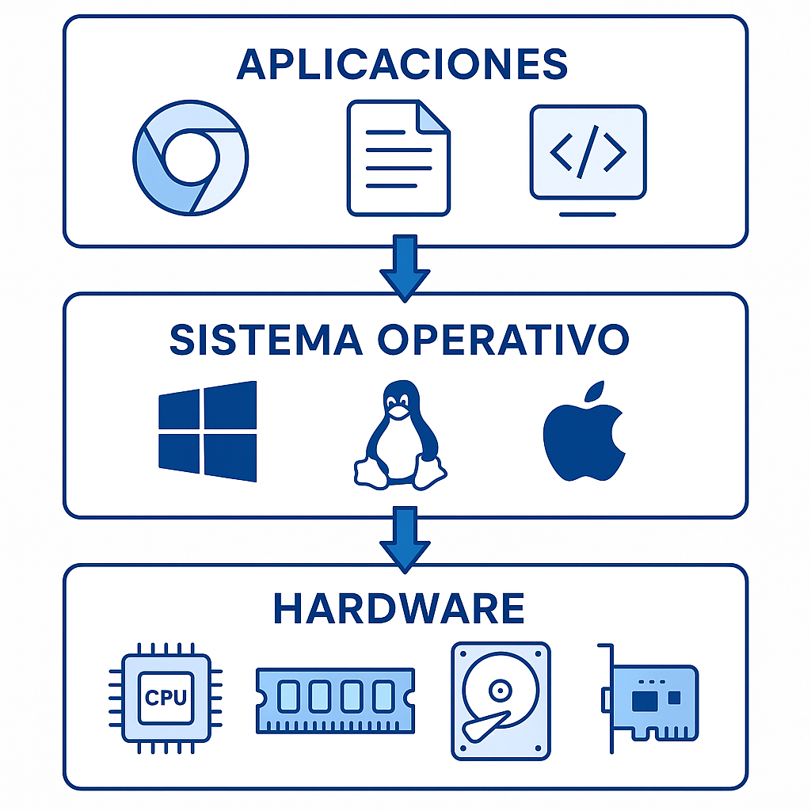
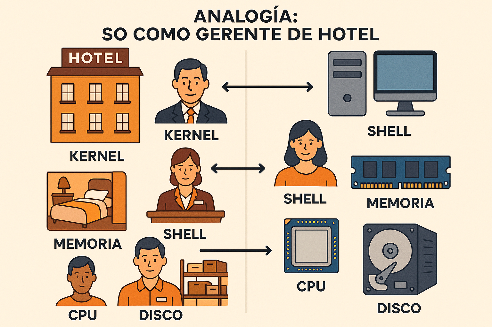
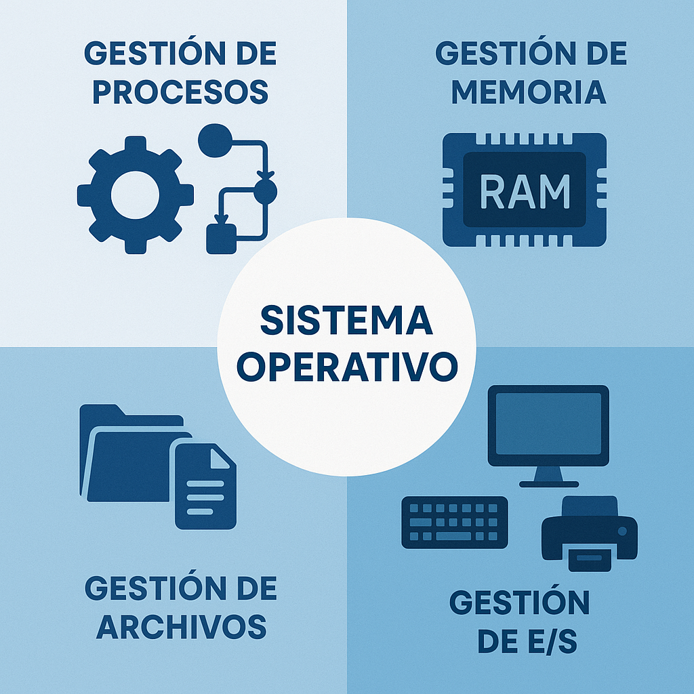

# Clase 1: ¿Qué es un Sistema Operativo?
## Definición, Funciones y Propósito

<style>
img {
  max-width: 70% !important;
  max-height: 50vh !important;
  object-fit: contain !important;
  height: auto !important;
  display: block !important;
  margin: 0 auto !important;
}
section {
  font-size: 20px;
  overflow: hidden;
}
section h1 {
  font-size: 1.8em;
}
section h2 {
  font-size: 1.4em;
}
section h3 {
  font-size: 1.2em;
}
section ul, section ol {
  font-size: 0.9em;
  margin-left: 1em;
}
section li {
  margin-bottom: 0.3em;
}
section pre {
  font-size: 0.7em;
  max-height: 60vh;
  overflow-y: auto;
}
section code {
  font-size: 0.85em;
}
section p {
  margin: 0.5em 0;
}
/* Estilos para tablas responsivas */
section table {
  width: 100%;
  max-width: 100%;
  font-size: 0.85em;
  border-collapse: collapse;
  margin: 0.5em auto;
  table-layout: auto;
}
section th {
  background-color: #1e40af;
  color: white;
  padding: 0.4em 0.6em;
  text-align: left;
  font-size: 0.9em;
  border: 1px solid #ddd;
}
section td {
  padding: 0.4em 0.6em;
  border: 1px solid #ddd;
  vertical-align: top;
  word-wrap: break-word;
  font-size: 0.85em;
}
section tbody tr:nth-child(even) {
  background-color: #f8f9fa;
}
section tbody tr:hover {
  background-color: #e9ecef;
}
/* Asegurar que el contenido no desborde */
section {
  padding: 1em 2em;
  box-sizing: border-box;
}
/* Responsividad para tablas anchas */
@media screen and (max-width: 1280px) {
  section table {
    font-size: 0.75em;
  }
  section th, section td {
    padding: 0.3em 0.4em;
  }
}
</style>

<!--
[2026-01-31] - Clase enriquecida con infografías

CAMBIOS REALIZADOS:
- Se añadieron 3 infografías educativas
- Se mejoraron las visualizaciones de conceptos clave

IMÁGENES GENERADAS:
- so-capas-sistema.png: Diagrama de capas (Aplicaciones, SO, Hardware)
- so-funciones-principales.png: Las 4 funciones del SO
- so-analogia-hotel.png: Analogía del hotel para explicar el SO
-->


**IF0099 - Sistemas Operativos I**
*4° Semestre - Ingeniería Informática*

---

## Objetivos de la Clase

Al finalizar esta clase, el estudiante será capaz de:

1. **Definir** qué es un sistema operativo y su propósito
2. **Identificar** las funciones principales de un SO
3. **Comparar** las arquitecturas monolítica, por capas y microkernel
4. **Describir** los servicios que proporciona el SO
5. **Explicar** el concepto de llamadas al sistema (system calls)
6. **Comprender** la relación entre hardware, SO y aplicaciones
7. **Reconocer** los SO más utilizados en la actualidad

**Duración:** 90 minutos

---

## Agenda

1. ¿Qué es un Sistema Operativo? (15 min)
2. Funciones principales del SO (20 min)
3. Arquitecturas del SO (15 min)
4. Servicios y Llamadas al Sistema (15 min)
5. El SO como interfaz (10 min)
6. Sistemas Operativos actuales (10 min)
7. Actividad práctica (5 min)

---

## 1. ¿Qué es un Sistema Operativo?

### Definición Formal

> Un **Sistema Operativo (SO)** es el software que actúa como intermediario entre el usuario y el hardware del computador, gestionando los recursos y proporcionando servicios a las aplicaciones.



### ¿Por qué necesitamos un SO?

Sin un SO, cada programa tendría que:
- 🔧 Manejar directamente el hardware (¡muy complejo!)
- 🔄 Gestionar su propia memoria
- 📁 Implementar su propio sistema de archivos
- 🚫 No podría ejecutarse con otros programas

**El SO hace todo esto por nosotros.**


---

## Analogía del SO: El Hotel 🏨

### El SO como el "Gerente de un Hotel"



**¿Por qué un hotel?** Ambos deben gestionar recursos finitos (habitaciones/RAM) entre múltiples usuarios concurrentes de forma segura y eficiente.

---

## Analogía del Hotel: Equivalencias Detalladas

<div style="display: flex; gap: 20px;">

<div style="flex: 1;">

### 🏨 Elementos del Hotel
- **Huéspedes** → Llegan, solicitan servicios, usan recursos
- **Gerente** → Coordina todo, toma decisiones de asignación
- **Habitaciones** → Espacio limitado que debe asignarse
- **Recepción** → Registra quién está dónde y cuándo
- **Seguridad** → Controla quién entra a qué áreas
- **Mantenimiento** → Repara y mantiene funcionando todo

</div>

<div style="flex: 1;">

### 💻 Elementos del Sistema
- **Usuarios/Aplicaciones** → Programas que necesitan recursos
- **Sistema Operativo** → Gestiona y coordina todo
- **Memoria RAM** → Espacio limitado para programas
- **Sistema de Archivos** → Organiza y localiza datos
- **Protección/Permisos** → Controla accesos a recursos
- **Drivers/Gestión E/S** → Mantiene dispositivos funcionando

</div>

</div>

> **💡 Insight:** El huésped no necesita saber cómo funciona la caldera ni la red eléctrica; solo pide agua caliente. Igualmente, el programador no necesita saber cómo funciona el disco duro; solo pide "abrir archivo".

---

## Analogía en Acción: Escenarios

| Escenario Hotel | Escenario Computador | Acción del "Gerente" (SO) |
|-----------------|----------------------|---------------------------|
| Huésped solicita habitación | Programa solicita memoria | Busca espacio disponible, asigna, registra |
| Dos huéspedes quieren la misma suite | Dos procesos compiten por CPU | Decide quién usa el recurso y por cuánto tiempo |
| Huésped deja la habitación | Programa termina | Libera recursos, limpia, actualiza registros |
| Robo en una habitación | Proceso intenta leer memoria ajena | Bloquea acceso, notifica violación de seguridad |
| Llamada de emergencia | Interrupción de hardware | Atiende inmediatamente, suspende tareas actuales |

---

## 2. Funciones Principales del SO

### Las 4 funciones fundamentales

> El SO realiza **4 tareas principales** para que el computador funcione



---

## Resumen de las 4 Funciones

| Función | Responsabilidad |
|---------|-----------------|
| **Gestión de Procesos** | Crear, terminar y coordinar programas |
| **Gestión de Memoria** | Asignar y liberar RAM, proteger memoria |
| **Gestión de Archivos** | Organizar, almacenar y recuperar datos |
| **Gestión de E/S** | Controlar dispositivos (teclado, disco, red) |

Estas cuatro funciones permiten que **múltiples programas** se ejecuten simultáneamente sin conflictos.

---

## 2.1 Gestión de Procesos

### ¿Qué es un proceso?

> Un **proceso** es un programa en ejecución + sus recursos (memoria, archivos, CPU)

### Programa vs Proceso

| Aspecto | Programa | Proceso |
|---------|----------|---------|
| **Qué es** | Archivo en disco | Instancia activa en memoria |
| **Estado** | Pasivo (no hace nada) | Activo (se está ejecutando) |
| **Ejemplo** | `chrome.exe` en C: | Chrome abierto con 5 pestañas |
| **Recursos** | Solo ocupa espacio en disco | Usa RAM, CPU, archivos |

### El SO debe gestionar:
- 🔹 **Crear** y **terminar** procesos (lifecycle)
- 🔹 **Suspender** y **reanudar** procesos (scheduling)
- 🔹 **Sincronizar** procesos (evitar conflictos)
- 🔹 **Comunicar** procesos entre sí (IPC)

### Analogía: Programa = Receta, Proceso = Cocinando

```
PROGRAMA                    PROCESO
─────────                  ─────────
La receta de pasta    →   Alguien cocinando pasta
(en papel)                  (usando ingredientes, fuego, tiempo)
```

### Ejemplo en Windows
```
Ctrl + Shift + Esc → Administrador de Tareas
```
Verás: chrome.exe (5 procesos), spotify.exe, vscode.exe, etc.

### Ejemplo en Linux
```bash
# Ver todos los procesos
ps aux

# Ver procesos en tiempo real
top
```

---

## 2.2 Gestión de Memoria

### ¿Qué gestiona el SO?

> El **SO es el administrador de la RAM**: decide quién usa qué y cuándo

### La RAM como un edificio de oficinas

```
┌─────────────────────────────────────┐
│           EDIFICIO (RAM 16GB)       │
├─────────┬─────────┬─────────┬───────┤
│ Oficina │ Oficina │ Oficina │ Libre │
│ SO 2GB  │ Chrome  │ Spotify │ 3GB   │
│         │ 500MB   │ 200MB   │       │
└─────────┴─────────┴─────────┴───────┘
```

### Funciones del SO:
- 🔹 **Asignar** memoria a procesos cuando la necesitan
- 🔹 **Liberar** memoria cuando un proceso termina
- 🔹 **Proteger** la memoria (que Chrome no lea datos de Spotify)
- 🔹 **Memoria virtual** (swap: usar disco como RAM extendida)

### ¿Por qué es importante?
Sin gestión de memoria, un programa podría escribir en la memoria de otro → **crash** o **brecha de seguridad**

### Ejemplo: Ver uso de memoria
**Windows:** `Ctrl + Shift + Esc` → pestaña "Rendimiento"
**Linux:** `free -h` o `top`

---

## 2.3 Gestión de Archivos

### ¿Qué hace el SO?

> El SO organiza tus archivos como **bibliotecario**: sabe dónde está todo

### Sistema de archivos jerárquico (árbol de directorios)

```
📁 C:\ o / (raíz)
├── 📁 Windows/ o /bin      → Programas del sistema
├── 📁 Program Files/        → Apps instaladas
├── 📁 Users/                → Perfiles de usuario
│   └── 📁 estudiante/
│       ├── 📁 Documentos/   → Tus archivos
│       ├── 📁 Descargas/    → Descargas
│       └── 📁 Escritorio/   → Escritorio
└── 📁 ...                   → Más carpetas
```

### Funciones del SO:
- 🔹 **Crear, eliminar, renombrar** archivos y carpetas
- 🔹 **Organizar** en directorios (estructura jerárquica)
- 🔹 **Permisos**: quién puede leer/escribir (chmod, chown)
- 🔹 **Gestionar espacio**: ubicación física en disco

### Analogía: Sistema de archivos = Archivo físico
```
Disco duro          Archivo de oficinas
─────────          ──────────────────
Directorios        Carpetas y archivadores
Archivos           Documentos individuales
Permisos           Cerrojos y llaves
```

### Ejemplo: Comandos básicos
| Acción | Windows | Linux |
|--------|---------|-------|
| Listar | `dir` | `ls` |
| Crear carpeta | `mkdir` | `mkdir` |
| Cambiar directorio | `cd` | `cd` |
| Copiar | `copy` | `cp` |

---

## 2.4 Gestión de Entrada/Salida

### ¿Qué es E/S (Input/Output)?

> La comunicación entre el computador y el mundo exterior

### Dispositivos de E/S

| Entrada (Input) | Salida (Output) | Ambos (I/O) |
|-----------------|-----------------|-------------|
| ⌨️ Teclado | 🖥️ Monitor | 💾 Disco duro |
| 🖱️ Mouse | 🖨️ Impresora | 🔌 USB |
| 🎤 Micrófono | 🔊 Parlantes | 🌐 Red |
| 📷 Cámara | - | 📱 Pantalla táctil |
| 🎮 Joystick | 🎧 Auriculares | 💿 CD/DVD |

### ¿Cómo gestiona el SO los dispositivos?

1. **Drivers**: Software que "habla" el idioma de cada dispositivo
2. **Abstracción**: Todos los dispositivos se ven como "archivos" para el programa
3. **Interrupciones**: El dispositivo avisa "¡tengo datos listos!"
4. **Buffering**: Datos temporales mientras se procesan

### Analogía: El SO como traductor universal
```
Programa       →   SO (driver)   →   Impresora
"imprimir"     →   traduce       →   lenguaje Epson
```

### Ejemplo: Ver dispositivos
**Windows:** `Administrador de dispositivos` (devmgmt.msc)
**Linux:** `lsusb`, `lspci`, `lsblk`

---

## 3. Arquitecturas del Sistema Operativo

### Tipos de estructura interna

#### Monolítico

**Características principales:**
- Todos los servicios del SO están en un único bloque (kernel)
- Comunicación directa entre componentes (llamadas a funciones)
- Alto rendimiento pero difícil de mantener
- Un error puede crashing todo el sistema

**Ejemplos:** Linux, MS-DOS, UNIX original

```
┌─────────────────────────────────────────────────────────────────┐
│                 MONOLÍTICO (Linux, DOS)                          │
├─────────────────────────────────────────────────────────────────┤
│                                                                  │
│  ┌──────────────────────────────────────────────────────┐       │
│  │                    APLICACIONES                       │       │
│  └──────────────────────────────────────────────────────┘       │
│                              │                                   │
│                              ▼                                   │
│  ┌──────────────────────────────────────────────────────┐       │
│  │                     KERNEL                           │       │
│  │  ┌──────┬──────┬──────┬──────┬──────┬──────┐        │       │
│  │  │Gestor│Gestor│Gestor│Gestor│Gestor│Gestor│        │       │
│  │  │Proces│Memoria│Archiv│ E/S │Red   │...   │        │       │
│  │  └──────┴──────┴──────┴──────┴──────┴──────┘        │       │
│  └──────────────────────────────────────────────────────┘       │
│                              │                                   │
│                              ▼                                   │
│                         HARDWARE                                 │
└─────────────────────────────────────────────────────────────────┘
```

---

## Arquitectura por Capas

```
┌─────────────────────────────────────────────────────────┐
│  Nivel 5 │ Aplicaciones (shell, utilidades)             │
├──────────┼──────────────────────────────────────────────┤
│  Nivel 4 │ Gestión de archivos (file system)            │
├──────────┼──────────────────────────────────────────────┤
│  Nivel 3 │ Gestión de memoria virtual                   │
├──────────┼──────────────────────────────────────────────┤
│  Nivel 2 │ Gestión de procesos y E/S                    │
├──────────┼──────────────────────────────────────────────┤
│  Nivel 1 │ Comunicación con hardware (drivers)          │
├──────────┼──────────────────────────────────────────────┤
│  Nivel 0 │ Hardware (CPU, memoria, dispositivos)        │
└─────────────────────────────────────────────────────────┘
```

### Principio Fundamental: La Regla de las Capas
> **Cada capa solo puede:**
> 1. Usar servicios de la capa **inmediatamente inferior**
> 2. Proveer servicios a la capa **inmediatamente superior**

---

## Arquitectura por Capas: Análisis

<div style="display: flex; gap: 15px; font-size: 0.9em;">

<div style="flex: 1;">

### ✅ Ventajas
- **Modularidad**: Cada capa es un módulo independiente
- **Fácil depuración**: Errores se aislan en una capa
- **Desarrollo paralelo**: Equipos trabajan en capas diferentes
- **Verificación formal**: Se puede probar cada capa por separado

</div>

<div style="flex: 1;">

### ❌ Desventajas
- **Overhead**: Llamadas entre capas consumen tiempo
- **Definición de capas**: Decidir qué va en cada nivel es difícil
- **Rendimiento inferior** vs monolítico (5-10% más lento)
- **Rigidez**: Cambios en una capa pueden afectar otras

</div>

</div>

### Ejemplo Histórico: THE (Dijkstra, 1968)
- Primer SO con arquitectura de capas bien definida
- 5 niveles con funciones claramente separadas
- Demostró que la abstracción por capas era viable

### ¿Dónde se usa hoy?
- **TCP/IP**: Pila de red en capas (OSI model)
- **Sistemas embebidos**: Donde la claridad es prioridad
- **Sistemas educativos**: Para enseñar conceptos

---

## Microkernel: El Enfoque Minimalista

```
┌────────────────────────────────────────────────────────────┐
│                  MICROKERNEL (MINIX, QNX)                  │
├────────────────────────────────────────────────────────────┤
│                                                             │
│  ┌─────────────┐  ┌─────────────┐  ┌─────────────┐        │
│  │  Servicio   │  │  Servicio   │  │  Servicio   │        │
│  │  Archivos   │  │  Procesos   │  │  Memoria    │        │
│  │  (user)     │  │  (user)     │  │  (user)     │        │
│  └──────┬──────┘  └──────┬──────┘  └──────┬──────┘        │
│         │                │                │                │
│         └────────────────┼────────────────┘                │
│                          │                                 │
│                    ┌─────┴─────┐                          │
│                    │  KERNEL   │  ← Mínimo: IPC,          │
│                    │ Mínimo    │    scheduling básico     │
│                    └─────┬─────┘                          │
│                          │                                 │
│                          ▼                                 │
│                      HARDWARE                              │
└────────────────────────────────────────────────────────────┘
```

### Filosofía del Microkernel
> **"El kernel debe hacer lo mínimo indispensable; todo lo demás es servicio de usuario"**

---

## Microkernel: Componentes en el Kernel vs Usuario

<div style="display: flex; gap: 15px;">

<div style="flex: 1;">

### 🔴 En el Kernel (Mínimo)
- **Comunicación entre procesos (IPC)**
- **Scheduling básico** (decidir quién corre)
- **Manejo básico de memoria**
- **Manejo de interrupciones**
- **Primitivas de sincronización**

**Tamaño típico:** 10,000 - 50,000 líneas de código

</div>

<div style="flex: 1;">

### 🔵 En Modo Usuario (Servidores)
- **Sistema de archivos** (puede fallar sin crashear SO)
- **Drivers de dispositivos** (aislados del kernel)
- **Gestión de memoria virtual**
- **Red y protocolos de comunicación**
- **Interfaz de usuario**

**Ventaja:** Si falla un driver, se reinicia sin afectar el sistema

</div>

</div>

---

## Microkernel: Casos de Uso Reales

| Sistema | Uso Principal | Características |
|---------|---------------|-----------------|
| **MINIX** | Educación/Investigación | Tanenbaum lo diseñó para enseñar; código muy limpio |
| **QNX** | Automotriz/Industrial | Usado en 200+ millones de vehículos (infoentretenimiento) |
| **seL4** | Sistemas críticos | Primer kernel con verificación formal de corrección |
| **L4** | Virtualización | Base de muchos hypervisors modernos |
| **Mach** | macOS/iOS (híbrido) | Precursor del kernel XNU de Apple |

### 📱 Dato Curioso: iPhone usa microkernel (parcial)
iOS/macOS usan **XNU** (X is Not Unix), un híbrido basado en Mach microkernel + componentes BSD. Los drivers corren en modo usuario para mayor estabilidad.

---

## Comparación de Arquitecturas

| Característica | Monolítico | Capas | Microkernel |
|----------------|------------|-------|-------------|
| **Rendimiento** | 5/5 | 3/5 | 2/5 |
| **Seguridad** | 2/5 | 3/5 | 5/5 |
| **Mantenibilidad** | 2/5 | 3/5 | 5/5 |
| **Ejemplos** | Linux, DOS | THE, VAX | MINIX, QNX |

### Híbrido (Windows NT, macOS XNU)
Combina lo mejor: núcleo híbrido con drivers en modo usuario.

---

## 4. Servicios del Sistema Operativo

### Qué proporciona el SO a los programas

| Servicio | Descripción | Ejemplo |
|----------|-------------|---------|
| **Ejecución de programas** | Cargar y ejecutar procesos | `exec()`, `fork()` |
| **Operaciones de E/S** | Acceso a dispositivos | `read()`, `write()` |
| **Manipulación de archivos** | Crear, borrar, organizar | `open()`, `mkdir()` |
| **Comunicación** | Entre procesos (IPC) | pipes, sockets |
| **Detección de errores** | Hardware y software | Excepciones, logs |
| **Asignación de recursos** | CPU, memoria, disco | Scheduler, allocators |
| **Protección** | Seguridad y acceso | Permisos, ACLs |

---

## 5. Llamadas al Sistema (System Calls)

### La interfaz entre programa y SO

```
┌─────────────────────────────────────────────────────────────┐
│  MODO USUARIO                    MODO KERNEL               │
│  ────────────                    ───────────               │
│                                                             │
│  Programa                                                   │
│     │                                                       │
│     │ printf("Hola")                                        │
│     ▼                                                       │
│  Biblioteca C (libc)                                        │
│     │                                                       │
│     │ write(fd, buffer, size)                               │
│     ▼                                                       │
│  ┌─────────────┐              ┌──────────────────────┐     │
│  │  TRAP/INT   │ ───────────► │  Manejador de syscall │     │
│  │  (syscall)  │              │  sys_write()          │     │
│  └─────────────┘              └──────────────────────┘     │
│                                          │                  │
│                                          ▼                  │
│                                    Driver de disco         │
│                                          │                  │
│                                          ▼                  │
│                                       HARDWARE              │
└─────────────────────────────────────────────────────────────┘
```

### ¿Por qué dos modos de operación?
| Modo | Privilegios | Puede acceder a | Ejemplos de instrucciones |
|------|-------------|-----------------|---------------------------|
| **Usuario** | Limitados | Memoria propia | ADD, MOV, JMP |
| **Kernel** | Totales | Todo el hardware | IN, OUT, HLT, CLI |

> **El TRAP/INT es la "puerta" controlada** que permite al programa solicitar servicios del kernel de forma segura.

---

## System Calls: El Mecanismo Paso a Paso

### ¿Qué sucede realmente cuando llamas a `printf()`?

<div style="display: flex; gap: 10px; font-size: 0.85em;">

<div style="flex: 1;">

**Paso 1: Biblioteca C**
```c
printf("Hola");
```
La función de usuario prepara los parámetros en registros/Stack.

**Paso 2: Preparar Syscall**
```c
// libc prepara:
mov eax, 4      // syscall número 4 = write
mov ebx, 1      // fd = stdout
mov ecx, msg    // dirección del mensaje
mov edx, 4      // longitud
```

</div>

<div style="flex: 1;">

**Paso 3: Ejecutar INT/_SYSCALL**
```asm
int 0x80        // Interrupción 0x80 (Linux x86)
// o
syscall         // Instrucción syscall (x86_64)
```
**¡Cambio de contexto!** CPU cambia a modo kernel.

**Paso 4: Kernel ejecuta**
```c
// sys_write() en el kernel:
// 1. Verifica permisos del fd
// 2. Copia datos de usuario a kernel
// 3. Llama al driver de consola
// 4. Escribe en hardware
```

</div>

<div style="flex: 1;">

**Paso 5: Retorno**
```asm
// Kernel devuelve resultado
// en registro eax/rax
iret            // Retorna a modo usuario
```

**Paso 6: Continúa programa**
```c
// libc recibe resultado
// y retorna a printf()
```

</div>

</div>

> ⚠️ **Cambiar de modo usuario a kernel es costoso** (~100-1000 ciclos de CPU). Por eso existen optimizaciones como `vDSO` (evitar syscall para gettimeofday).

---

## Categorías de System Calls

| Categoría | Ejemplos (Linux) | Función |
|-----------|------------------|---------|
| **Control de procesos** | `fork()`, `exec()`, `exit()`, `wait()` | Crear, terminar procesos |
| **Manejo de archivos** | `open()`, `read()`, `write()`, `close()` | Operaciones con archivos |
| **Gestión de dispositivos** | `ioctl()`, `read()`, `write()` | Control de hardware |
| **Información del sistema** | `getpid()`, `time()`, `uname()` | Datos del sistema |
| **Comunicación** | `pipe()`, `socket()`, `send()`, `recv()` | IPC y red |

### Ejemplo práctico: Crear un proceso
```c
#include <unistd.h>
#include <sys/types.h>

pid_t pid = fork();    // Crear proceso hijo
if (pid == 0) {
    // Código del hijo
    execl("/bin/ls", "ls", "-l", NULL);  // Ejecutar ls
} else {
    // Código del padre
    wait(NULL);        // Esperar al hijo
}
```

---

## 6. El SO como Interfaz

### Dos tipos de interfaz para el usuario

```
┌───────────────────────────────────────────────┐
│                 USUARIO                        │
└───────────────────┬───────────────────────────┘
          ┌─────────┴─────────┐
          ▼                   ▼
    ┌───────────┐       ┌───────────┐
    │    GUI    │       │    CLI    │
    │ (Gráfica) │       │ (Comandos)│
    └───────────┘       └───────────┘
    - Windows           - cmd, PowerShell
    - macOS Finder      - Bash, Zsh
    - GNOME, KDE        - Terminal
```

---

## GUI vs CLI

| Aspecto | GUI | CLI |
| --------- | ----- | ----- |
| Facilidad | 5/5 | 2/5 |
| Potencia | 3/5 | 5/5 |
| Automatización | 2/5 | 5/5 |
| Recursos | Alto consumo | Bajo consumo |
| Servidores | Poco usado | **Estándar** |

### En este curso usaremos ambas, pero enfatizaremos CLI (Linux)

---

## 7. Sistemas Operativos Actuales (2026)

### Panorama Global por Segmento

```
ESCRITORIO/LAPTOP          SERVIDORES WEB          MÓVILES
┌─────────────┐            ┌─────────────┐          ┌─────────────┐
│ Windows 70% │            │ Linux  96%  │          │Android 71%  │
│ macOS   16% │            │ Windows 4%  │          │ iOS    28%  │
│ ChromeOS 10%│            │             │          │ Otros   1%  │
│ Linux    4% │            │             │          │             │
└─────────────┘            └─────────────┘          └─────────────┘
```

### Observación clave:
**Linux domina servidores (96%) pero solo tiene 4% en escritorio.**
¿Por qué? Lo veremos a continuación...

---

## ¿Por qué cada SO domina su nicho?

### Windows: Rey del escritorio corporativo

**Fortalezas:**
- ✅ Compatibilidad con software empresarial (Office, SAP, Adobe)
- ✅ Soporte técnico global
- ✅ Interfaz familiar para usuarios no técnicos
- ✅ Ecosistema de drivers amplio

**Casos de uso:**
- 🏢 Oficinas corporativas (95% usan Windows)
- 🎮 Gaming (80% de juegos para PC)
- 🏫 Educación básica y media
- 🏭 Industria con software propietario

---

## Linux: Dominio absoluto en servidores

### ¿Por qué Linux domina el 96% de servidores web?

**Ventajas técnicas:**
1. **Gratuito**: Sin costos de licencia (ahorro masivo)
2. **Estable**: Uptime de años sin reinicios
3. **Seguro**: Menos vulnerabilidades que Windows
4. **Ligero**: Consume menos recursos (más eficiente)
5. **Automatizable**: Scripts y configuración por código

### Ejemplos del mundo real:
```
🌐 Google: 100% Linux (Ubuntu modificado)
🛒 Amazon: 100% Linux (AWS corre en Linux)
📘 Facebook: 100% Linux (CentOS/RedHat)
🎬 Netflix: 100% Linux (FreeBSD en CDN)
🔎 Wikipedia: 100% Linux (Ubuntu)
```

**Conclusión:** Si un servidor web NO usa Linux, es la excepción.

---

## macOS: Ecosistema cerrado pero potente

### Nicho específico: Desarrollo y creatividad

**Fortalezas:**
- 🎨 **Industria creativa**: Video, música, diseño (Final Cut, Logic Pro)
- 💻 **Desarrollo iOS**: Único SO donde se puede desarrollar apps iOS
- 🔒 **Integración**: Funciona perfectamente con iPhone, iPad, Apple Watch
- 🛡️ **Seguridad**: Menos malware que Windows

**Estadísticas interesantes:**
- 40% de desarrolladores profesionales usan macOS
- 90% de diseñadores gráficos profesionales usan macOS
- 100% de desarrollo iOS requiere macOS

---

## Chrome OS: El SO de la nube

### Concepto: "Todo en el navegador"

**Características:**
- 🌐 Basado en Chrome browser
- ☁️ Todo en la nube (Google Drive, Docs, etc.)
- 💰 Chromebooks muy económicos ($200-$400)
- ⚡ Arranque en 8 segundos

**Casos de uso:**
- 📚 Educación primaria y secundaria (50% de escuelas en USA)
- 🏠 Uso personal básico (email, navegación, streaming)
- ⚠️ **Limitación**: Requiere conexión a Internet constante

---

## Sistemas Operativos Móviles

### Duopolio Android vs iOS

| Aspecto | Android (71%) | iOS (28%) |
| --------- | --------------- | ----------- |
| Fabricantes | Samsung, Xiaomi, Huawei, etc. | Solo Apple |
| Precio | $100 - $1500 | $400 - $1600 |
| Apertura | Código abierto | Cerrado |
| Tienda apps | Google Play | App Store |
| Cuota global | **71%** | **28%** |
| Cuota en USA | 40% | **60%** |

**Dato curioso:** Android es Linux modificado (kernel Linux + capa Android)

---

## Sistemas Operativos Embebidos

### SO que no ves pero usas todos los días

```
🚗 Automóviles:        Linux, QNX, Android Automotive
🏠 Smart TVs:          Android TV, webOS, Tizen
⌚ Smartwatches:       watchOS, Wear OS (Android)
🎮 Consolas:          PlayStation OS, Xbox OS (Windows modificado)
📡 Routers:           OpenWrt, DD-WRT (Linux)
✈️  Aviones:           VxWorks, Linux (sistemas críticos)
🏥 Equipo médico:     QNX, Linux (certificado)
```

**Observación:** Linux está en todas partes, incluso donde no lo imaginas.

---

## Familias de Sistemas Operativos

### Dos grandes linajes históricos

> Los SO modernos provienen de dos ramas: **UNIX** (1969) y **MS-DOS** (1981)

#### Familia UNIX (1969 - presente)

```
                    ┌─────────────┐
                    │   UNIX      │  ← Bell Labs
                    │   (1969)    │
                    └──────┬──────┘
           ┌───────────────┼───────────────┐
           ▼               ▼               ▼
      ┌────────┐      ┌────────┐      ┌────────┐
      │ BSD    │      │ Linux  │      │ macOS  │
      │ (1977) │      │ (1991) │      │ (2001) │
      └────────┘      └───┬────┘      └────────┘
                    ┌─────┼─────┐
                    ▼     ▼     ▼
                 Ubuntu Fedora Android
```

**Características:** Multiusuario, permisos rwx, "todo es un archivo"

#### Familia Windows (1981 - presente)

```
      ┌─────────────┐
      │  MS-DOS     │  ← Microsoft, IBM PC
      │  (1981)     │
      └──────┬──────┘
             ▼
      ┌─────────────┐
      │  Windows    │  ← 1.0→95→XP→7→10→11
      │ (1985-hoy)  │
      └─────────────┘
```

**Características:** GUI predominante, Registro, DirectX

### Impacto actual

| Familia | Dominio | Cuota |
|---------|---------|------|
| UNIX/Linux | Servidores, móviles | ~96% servidores |
| Windows | Escritorio, gaming | ~70% escritorio |

---

---

## ¿Por qué Linux en este curso?

### Razones pedagógicas:
1. **Código abierto**: Podemos ver cómo funciona internamente
2. **Línea de comandos**: Entendemos mejor los conceptos
3. **Dominante en servidores**: Habilidad laboral esencial
4. **Gratuito**: Sin costo de licencias
5. **Seguro**: Ideal para aprender sin riesgos

### Usaremos: **Ubuntu 24.04 LTS**

---

## Actividad Práctica (10 min)

### En parejas, respondan:

**Tarea 1:** Identifiquen 3 procesos ejecutándose en su computador

---

## Actividad Práctica - Visualizar Procesos

### ¿Cómo ver los procesos?

**En Windows:**
- Opción 1: `Ctrl + Shift + Esc` (abre directo el Administrador de Tareas)
- Opción 2: `Ctrl + Alt + Supr` → seleccionar "Administrador de Tareas"
- Opción 3: Click derecho en la Barra de Tareas → "Administrador de Tareas"

**En Linux:**
- Terminal: `top`, `htop`, o `ps aux`
- Interfaz gráfica: Monitor del Sistema

---

## Actividad Práctica - Linux en el Curso

> **⚠️ IMPORTANTE:** En este curso usaremos exclusivamente **Linux (Ubuntu)** a través de:
> - **WSL (Windows Subsystem for Linux)** - Recomendado
> - **Máquina Virtual con VirtualBox**
> 
> Ver guía de instalación en el Laboratorio 1.

**Tarea 2:** ¿Cuánta RAM tiene su computador y cuánta está en uso?

**Tarea 3:** ¿Por qué creen que Linux domina en servidores pero Windows en escritorios?

---

## Resumen de la Clase

| Concepto | Descripción |
| ---------- | ------------- |
| **Sistema Operativo** | Software intermediario entre usuario y hardware |
| **Funciones** | Gestión de procesos, memoria, archivos y E/S |
| **Interfaz** | GUI (gráfica) y CLI (comandos) |
| **Kernel** | Núcleo del SO, gestiona recursos |

---

## Tarea para la próxima clase

### Investigación individual (entregar vía plataforma)

1. **Investiga** la historia de un SO (Windows, Linux, o macOS)
2. **Escribe** un párrafo de 150 palabras sobre:
   - Año de creación
   - Creador(es)
   - Versiones importantes
   - Un dato curioso

**Fecha de entrega:** Próxima clase

---

## Bibliografía

- Silberschatz, A. (2018). *Operating System Concepts*. 10th Ed.
- Tanenbaum, A. (2015). *Modern Operating Systems*. 4th Ed.
- Stallings, W. (2018). *Operating Systems: Internals and Design Principles*

### Recursos en línea
- [OSDev Wiki](https://wiki.osdev.org/)
- [Linux Journey](https://linuxjourney.com/)

---

## Próxima Clase

### Clase 2: Evolución y Componentes del SO

- Historia de los sistemas operativos
- Generaciones de SO
- Componentes: Kernel, Shell, Utilidades
- Modos de operación: Usuario vs Kernel

**¡Nos vemos!**
