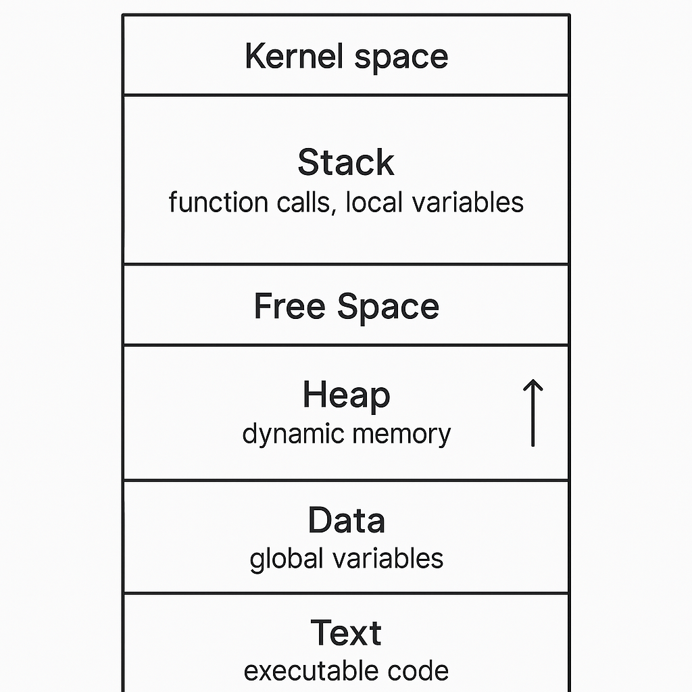
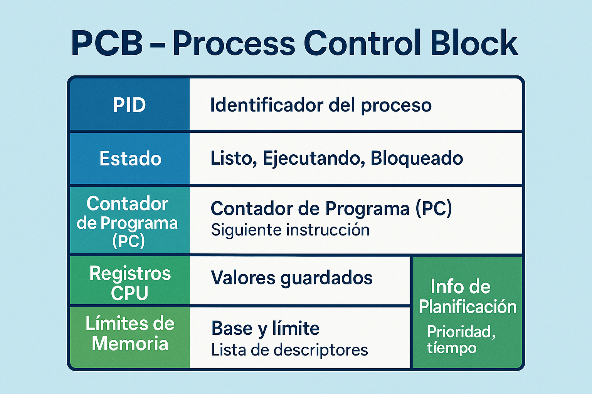
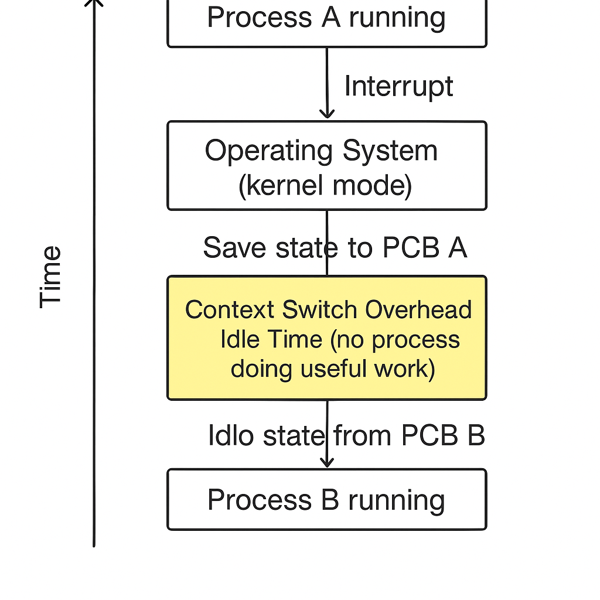

<style>
img {
  max-width: 70% !important;
  max-height: 50vh !important;
  object-fit: contain !important;
  height: auto !important;
  display: block !important;
  margin: 0 auto !important;
}
section {
  font-size: 20px;
  overflow: hidden;
}
section h1 {
  font-size: 1.8em;
}
section h2 {
  font-size: 1.4em;
}
section h3 {
  font-size: 1.2em;
}
section ul, section ol {
  font-size: 0.9em;
  margin-left: 1em;
}
section li {
  margin-bottom: 0.3em;
}
section pre {
  font-size: 0.7em;
  max-height: 60vh;
  overflow-y: auto;
}
section code {
  font-size: 0.85em;
}
section p {
  margin: 0.5em 0;
}
</style>


<!--
[2026-01-31] - Clase enriquecida con infografías

IMÁGENES GENERADAS:
- so-estados-proceso.png: Diagrama de estados de un proceso
- clase-03-pcb.png: Infografía del Bloque de Control de Proceso
-->

# Clase 3: Concepto de Proceso
## Programa vs Proceso, PCB y Estados

**IF0099 - Sistemas Operativos I**
*4° Semestre - Ingeniería Informática*

---

## Objetivos de la Clase

Al finalizar esta clase, el estudiante será capaz de:

1. **Diferenciar** entre programa y proceso
2. **Describir** la estructura del PCB (Process Control Block)
3. **Explicar** los estados de un proceso y sus transiciones
4. **Identificar** procesos en un sistema operativo real

**Duración:** 90 minutos

---

## Agenda

1. Programa vs Proceso (15 min)
2. Estructura de un proceso en memoria (20 min)
3. Process Control Block - PCB (20 min)
4. Estados de un proceso (25 min)
5. Actividad práctica (10 min)

---

## 1. Programa vs Proceso

### Definiciones

| Concepto | Descripción |
|----------|-------------|
| **Programa** | Código ejecutable almacenado en disco (estático) |
| **Proceso** | Programa en ejecución (dinámico) |

```
┌─────────────┐          ┌─────────────┐
│   PROGRAMA  │  cargar  │   PROCESO   │
│  (en disco) │ ───────→ │ (en memoria)│
│   .exe      │          │             │
│   estático  │          │  dinámico   │
└─────────────┘          └─────────────┘
```

### Analogía:
- **Programa** = Receta de cocina (instrucciones)
- **Proceso** = Acto de cocinar (ejecución)

---

## Un programa, múltiples procesos

### Ejemplo: Chrome

```
┌───────────────────────────────────────────────┐
│               chrome.exe (programa)            │
│                      │                         │
│         ┌───────────┬┴───────────┐            │
│         ▼           ▼            ▼            │
│   ┌─────────┐ ┌─────────┐ ┌─────────┐        │
│   │Proceso 1│ │Proceso 2│ │Proceso 3│        │
│   │ (Tab 1) │ │ (Tab 2) │ │ (Tab 3) │        │
│   │ PID:1234│ │ PID:1235│ │ PID:1236│        │
│   └─────────┘ └─────────┘ └─────────┘        │
└───────────────────────────────────────────────┘
```

Cada pestaña de Chrome es un **proceso separado** con su propio PID.

---

## 2. Estructura de un Proceso en Memoria

    Direcciones altas
         │
         ▼

{: style="max-width: 80%; max-height: 500px; display: block; margin: 0 auto;"}

    Direcciones bajas

---

## Segmentos de Memoria

| Segmento | Contenido | Tamaño |
|----------|-----------|--------|
| **TEXT** | Código ejecutable | Fijo |
| **DATA** | Variables globales inicializadas | Fijo |
| **BSS** | Variables globales no inicializadas | Fijo |
| **HEAP** | Memoria dinámica (malloc/new) | Variable |
| **STACK** | Variables locales, parámetros, retornos | Variable |

```c
int global = 5;         // DATA
int sin_inicializar;    // BSS

int main() {
    int local = 10;     // STACK
    int *ptr = malloc(100); // HEAP
    return 0;
}
```

---

## 3. Process Control Block (PCB)

### La "ficha" de cada proceso

El SO mantiene un **PCB** por cada proceso. Contiene TODA la información necesaria para gestionar el proceso.

{: style="max-width: 80%; max-height: 500px; display: block; margin: 0 auto;"}

---

### Representación ASCII:

```
┌─────────────────────────────────────┐
│        PROCESS CONTROL BLOCK        │
├─────────────────────────────────────┤
│  PID: 1234                          │
│  Estado: RUNNING                    │
│  Contador de programa: 0x00400120   │
│  Registros CPU: [R1=5, R2=100, ...] │
│  Límites de memoria: 0x1000-0x9000  │
│  Lista de archivos abiertos: [...]  │
│  Información de E/S: [...]          │
│  Información de planificación: [...]│
│  Información de contabilidad: [...] │
│  Puntero a PCB del padre            │
│  Puntero a PCBs de hijos            │
└─────────────────────────────────────┘
```

---

## Campos del PCB

| Campo | Descripción |
|-------|-------------|
| **PID** | Identificador único del proceso |
| **Estado** | Running, Ready, Blocked, etc. |
| **Program Counter** | Siguiente instrucción a ejecutar |
| **Registros CPU** | Valores actuales de registros |
| **Info de memoria** | Límites, tablas de páginas |
| **Info de E/S** | Archivos abiertos, dispositivos |
| **Info de planificación** | Prioridad, tiempo de CPU usado |
| **Info de contabilidad** | Tiempo de inicio, recursos usados |

---

## Context Switch (Cambio de Contexto)

### Cuando el SO cambia de un proceso a otro

{: style="max-width: 80%; max-height: 500px; display: block; margin: 0 auto;"}

**El context switch tiene costo** (overhead)

---

## 4. Estados de un Proceso

### Modelo de 5 estados

{: style="max-width: 80%; max-height: 500px; display: block; margin: 0 auto;"}

---

## Estados en Detalle

| Estado | Descripción | Ejemplo |
|--------|-------------|---------|
| **NUEVO** | Proceso recién creado, aún no admitido | fork() acaba de ejecutarse |
| **LISTO** | Esperando CPU para ejecutar | En cola de procesos listos |
| **EJECUTANDO** | Usando la CPU actualmente | Solo 1 por CPU/núcleo |
| **BLOQUEADO** | Esperando un evento (E/S, recurso) | Esperando lectura de disco |
| **TERMINADO** | Proceso ha finalizado, pendiente de limpieza | exit() ejecutado |

---

## Transiciones de Estado

| Transición | Causa |
|------------|-------|
| Nuevo → Listo | SO admite el proceso |
| Listo → Ejecutando | Planificador selecciona el proceso (**dispatch**) |
| Ejecutando → Listo | Timeout, proceso cede CPU (**preemption**) |
| Ejecutando → Bloqueado | Proceso solicita E/S o recurso |
| Bloqueado → Listo | E/S completada, recurso disponible |
| Ejecutando → Terminado | Proceso finaliza (exit) |

---

## Ver procesos en Linux

### Comando `ps`

```bash
$ ps aux
USER    PID  %CPU %MEM    VSZ   RSS TTY  STAT START   TIME COMMAND
root      1   0.0  0.1 169584 13256 ?    Ss   Jan30   0:02 /sbin/init
root      2   0.0  0.0      0     0 ?    S    Jan30   0:00 [kthreadd]
user   1234   2.5  1.2 456789 98765 ?    Sl   10:00   0:30 /usr/bin/code
user   5678   0.5  0.8 234567 65432 ?    Sl   10:15   0:10 /usr/bin/firefox
```

### Significado de STAT:
- **R**: Running (ejecutando)
- **S**: Sleeping (bloqueado, esperando)
- **D**: Uninterruptible sleep (E/S)
- **Z**: Zombie (terminado, esperando padre)
- **T**: Stopped (detenido)

---

## Ver procesos en tiempo real

### Comando `htop` (Linux)

```
┌──────────────────────────────────────────────────────────┐
│  CPU[|||||||||||||||                           45.2%]    │
│  Mem[||||||||||||||||||||||||||||              62.5%]    │
│  Swp[                                          0.0%]    │
├──────────────────────────────────────────────────────────┤
│  PID USER      PRI  NI  VIRT   RES   SHR S CPU% MEM%    │
│ 1234 user       20   0  456M   98M   45M S  2.5  1.2    │
│ 5678 user       20   0  234M   65M   30M S  0.5  0.8    │
│    1 root       20   0  169M   13M    8M S  0.0  0.1    │
└──────────────────────────────────────────────────────────┘
```

### Comando equivalente en Windows:
```powershell
Get-Process | Sort-Object CPU -Descending | Select-Object -First 10
```

---

## Creación de Procesos en Linux

### System Call: `fork()`

```c
#include <stdio.h>
#include <unistd.h>

int main() {
    pid_t pid = fork();  // Crea proceso hijo
    
    if (pid == 0) {
        // Código del HIJO
        printf("Soy el hijo, mi PID es %d\n", getpid());
    } else {
        // Código del PADRE
        printf("Soy el padre, mi hijo tiene PID %d\n", pid);
    }
    
    return 0;
}
```

---

## Árbol de Procesos

### En Linux, todos los procesos forman un árbol

```
                    init (PID 1)
                         │
         ┌───────────────┼───────────────┐
         │               │               │
      systemd         sshd            cron
         │               │
    ┌────┴────┐      ┌───┴───┐
    │         │      │       │
  gdm      pulseaudio bash   bash
    │                  │
 gnome-shell        vim
```

### Ver el árbol:
```bash
pstree -p
```

---

## Actividad Práctica (10 min)

### En parejas, ejecuten:

> **Nota para usuarios Windows:** Se recomienda usar **WSL** (Windows Subsystem for Linux) o una Máquina Virtual con Ubuntu.
> Para instalar WSL, abre PowerShell como administrador y ejecuta: `wsl --install`

**Linux (WSL/Ubuntu/VirtualBox):**
```bash
# Ver procesos con estados
ps aux | head -20

# Ver árbol de procesos
pstree -p | head -30

# Información de un proceso específico
cat /proc/self/status
```

**Windows (PowerShell):**
```powershell
# Ver procesos
Get-Process | Select-Object -First 20

# Información detallada
Get-Process -Name explorer | Format-List *
```

---

## Resumen de la Clase

| Concepto | Descripción |
|----------|-------------|
| **Programa** | Código estático en disco |
| **Proceso** | Programa en ejecución |
| **PCB** | Estructura con toda la info del proceso |
| **PID** | Identificador único |
| **Estados** | Nuevo, Listo, Ejecutando, Bloqueado, Terminado |
| **Context Switch** | Cambio de un proceso a otro |

---

## Tarea para próxima clase

### Investigación (en parejas)

1. **Investiguen** qué es un "proceso zombie" en Linux
2. **Expliquen** por qué ocurre y cómo se soluciona
3. **Escriban** un programa en C que cree un zombie (código + explicación)

**Entrega:** Documento PDF, máximo 2 páginas
**Sustentación:** Próxima clase, 5 minutos por pareja

---

## Próxima Clase

### Clase 4: Planificación de Procesos

- Algoritmos de planificación
- FCFS, SJF, Prioridad, Round Robin
- Métricas: Turnaround, Waiting Time, Response Time

**¡Nos vemos!**
