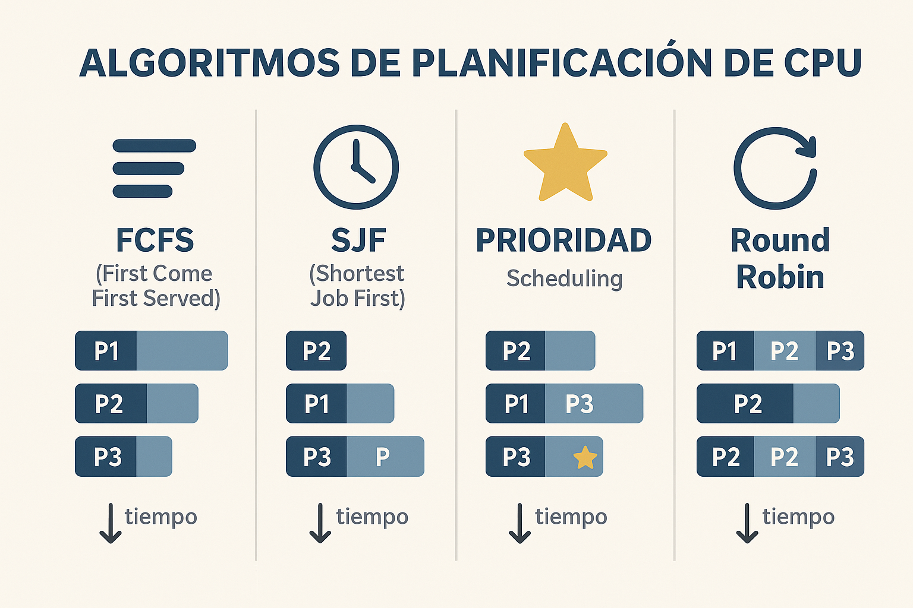
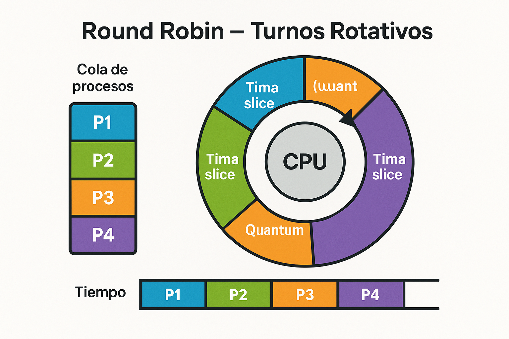
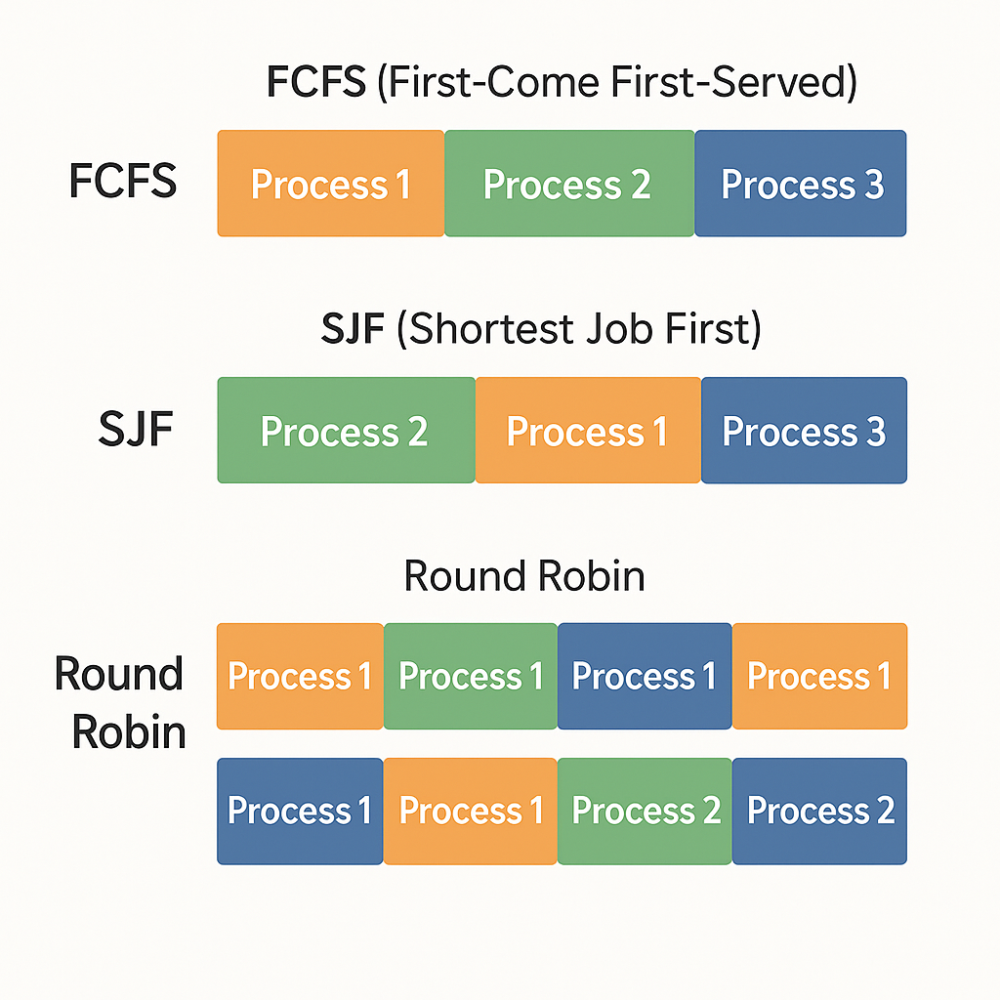

<!--
[2026-01-31] - Clase enriquecida con infografías

IMÁGENES GENERADAS:
- clase-04-algoritmos-planificacion.png: Comparación visual de FCFS, SJF, Prioridad, Round Robin
- clase-04-round-robin.png: Diagrama circular del algoritmo Round Robin
-->

# Clase 4: Planificación de Procesos
## Algoritmos FCFS, SJF, Prioridad y Round Robin

**IF0099 - Sistemas Operativos I**
*4° Semestre - Ingeniería Informática*

---

## Objetivos de la Clase

Al finalizar esta clase, el estudiante será capaz de:

1. **Explicar** el concepto de planificación de CPU
2. **Calcular** métricas de rendimiento (turnaround, waiting)
3. **Comparar** los algoritmos FCFS, SJF, Prioridad y Round Robin
4. **Aplicar** cada algoritmo a problemas prácticos

**Duración:** 90 minutos

---

## Agenda

1. ¿Qué es la planificación de CPU? (10 min)
2. Métricas de rendimiento (10 min)
3. Algoritmo FCFS (15 min)
4. Algoritmo SJF (15 min)
5. Algoritmo por Prioridad (15 min)
6. Algoritmo Round Robin (15 min)
7. Actividad práctica (10 min)

---

## 1. ¿Qué es la Planificación de CPU?

### El problema



---

### Representación ASCII:
```
        Cola de procesos LISTOS
┌─────┐ ┌─────┐ ┌─────┐ ┌─────┐
│ P1  │ │ P2  │ │ P3  │ │ P4  │ ──→ ? ──→ [CPU]
└─────┘ └─────┘ └─────┘ └─────┘
                                     │
                    ¿Quién va primero?
```

### El planificador (scheduler) decide:
- **¿Qué proceso** ejecutar?
- **¿Por cuánto tiempo?**
- **¿Cuándo** cambiar de proceso?

---

## Tipos de Planificación

### Según el momento de decisión

| Tipo | Cuándo actúa | Frecuencia |
|------|--------------|------------|
| **Largo plazo** | Admitir procesos nuevos | Minutos/horas |
| **Mediano plazo** | Swap in/out de memoria | Segundos/minutos |
| **Corto plazo** | Elegir proceso para CPU | Milisegundos |

### Nosotros nos enfocamos en **planificación de corto plazo**

---

## Preemptive vs Non-Preemptive

```
┌─────────────────────────────────────────────────────────┐
│                NON-PREEMPTIVE (Cooperativo)             │
│                                                         │
│  Proceso ejecuta hasta que:                             │
│  - Termina                                              │
│  - Se bloquea voluntariamente                           │
│                                                         │
│  El SO NO puede quitarle la CPU                         │
└─────────────────────────────────────────────────────────┘

┌─────────────────────────────────────────────────────────┐
│                PREEMPTIVE (Apropiativo)                 │
│                                                         │
│  El SO PUEDE interrumpir un proceso para:               │
│  - Dar turno a otro proceso                             │
│  - Responder a eventos de mayor prioridad               │
│                                                         │
│  Usado en sistemas modernos                             │
└─────────────────────────────────────────────────────────┘
```

---

## 2. Métricas de Rendimiento

### Datos de entrada

| Proceso | Tiempo de llegada | Tiempo de ráfaga (CPU) |
|---------|-------------------|------------------------|
| P1 | 0 | 5 |
| P2 | 1 | 3 |
| P3 | 2 | 8 |

### Métricas a calcular

| Métrica | Fórmula |
|---------|---------|
| **Turnaround Time** | Tiempo de finalización - Tiempo de llegada |
| **Waiting Time** | Turnaround Time - Tiempo de ráfaga |
| **Response Time** | Primera ejecución - Tiempo de llegada |

---

## 3. FCFS - First Come, First Served

### "El primero que llega, primero se atiende"

**Características:**
- Non-preemptive
- Simple de implementar
- Puede causar el **efecto convoy**

```
Llegada:  P1(0), P2(1), P3(2)
Ráfaga:   P1=5,  P2=3,  P3=8

Tiempo:  0    5    8         16
         │────│────│─────────│
         │ P1 │ P2 │   P3    │
         │────│────│─────────│
```

---

## FCFS - Cálculo de métricas

| Proceso | Llegada | Ráfaga | Inicio | Fin | Turnaround | Waiting |
|---------|---------|--------|--------|-----|------------|---------|
| P1 | 0 | 5 | 0 | 5 | 5-0=**5** | 5-5=**0** |
| P2 | 1 | 3 | 5 | 8 | 8-1=**7** | 7-3=**4** |
| P3 | 2 | 8 | 8 | 16 | 16-2=**14** | 14-8=**6** |

### Promedios:
- **Turnaround promedio:** (5+7+14)/3 = **8.67**
- **Waiting promedio:** (0+4+6)/3 = **3.33**

---

## Efecto Convoy en FCFS

### Cuando un proceso largo bloquea a los cortos

```
Procesos: P1(ráfaga=100), P2(ráfaga=1), P3(ráfaga=1)

FCFS:
│──────────────────────────────────────────│─│─│
│                  P1 (100)                │P2│P3│
0                                         100 101 102

P2 espera 100 unidades para ejecutar solo 1
P3 espera 101 unidades para ejecutar solo 1

¡MUY INEFICIENTE!
```

---

## 4. SJF - Shortest Job First

### "El más corto primero"

**Características:**
- Puede ser preemptive (SRTF) o non-preemptive
- **Óptimo** en términos de waiting time promedio
- Problema: ¿Cómo saber el tiempo de ráfaga?

```
Llegada:  P1(0), P2(1), P3(2)
Ráfaga:   P1=5,  P2=3,  P3=8

SJF Non-preemptive:
Tiempo:  0    5    8         16
         │────│────│─────────│
         │ P1 │ P2 │   P3    │  (P1 ya empezó)
         │────│────│─────────│
```

---

## SJF - Ejemplo con llegadas diferentes

```
| Proceso | Llegada | Ráfaga |
|---------|---------|--------|
| P1      | 0       | 7      |
| P2      | 2       | 4      |
| P3      | 4       | 1      |
| P4      | 5       | 4      |

SJF Non-preemptive:
t=0: Solo P1 disponible → ejecuta P1
t=7: P2, P3, P4 disponibles → P3 es más corto
t=8: P2, P4 disponibles → P2 = P4 → P2 (llegó primero)
t=12: Solo P4 → ejecuta P4

Tiempo:  0       7  8    12      16
         │───────│──│────│───────│
         │  P1   │P3│ P2 │  P4   │
```

---

## SRTF - Shortest Remaining Time First

### SJF Preemptive

```
| P1(0,7) | P2(2,4) | P3(4,1) | P4(5,4) |

t=0: P1 inicia (restante=7)
t=2: P2 llega (restante=4), 4<7 → P2 interrumpe
t=4: P3 llega (restante=1), 1<2 → P3 interrumpe
t=5: P3 termina, P4 llega. P2(2) < P4(4) < P1(5) → P2
t=7: P2 termina. P4(4) < P1(5) → P4
t=11: P4 termina → P1
t=16: P1 termina

Tiempo:  0    2    4 5    7       11      16
         │────│────│─│────│───────│───────│
         │ P1 │ P2 │P3│P2 │  P4   │  P1   │
```

---

## 5. Planificación por Prioridad

### Cada proceso tiene un número de prioridad

**Convención:** Menor número = Mayor prioridad (en este curso)

```
| Proceso | Llegada | Ráfaga | Prioridad |
|---------|---------|--------|-----------|
| P1      | 0       | 5      | 3         |
| P2      | 0       | 3      | 1 (alta)  |
| P3      | 0       | 8      | 2         |

Orden de ejecución: P2 → P3 → P1

Tiempo:  0    3         11      16
         │────│─────────│───────│
         │ P2 │   P3    │  P1   │
```

---

## Problema: Starvation (Inanición)

### Procesos de baja prioridad pueden no ejecutarse nunca

```
Si constantemente llegan procesos de alta prioridad...

P1 (prioridad=5) ───────────────→ NUNCA EJECUTA
                    ↑ ↑ ↑ ↑ ↑
         P_alta P_alta P_alta P_alta P_alta
         (prioridad=1)
```

### Solución: **Aging (Envejecimiento)**

Aumentar gradualmente la prioridad de procesos que esperan mucho tiempo.

---

## 6. Round Robin (RR)

### "Turnos rotativos" - El más usado



---

### Características:
- Preemptive
- Cada proceso recibe un **quantum** (tiempo máximo)
- Después del quantum, va al final de la cola
- **Justo**: todos reciben CPU eventualmente

---

## Round Robin - Ejemplo

```
| Proceso | Llegada | Ráfaga |  Quantum = 4
|---------|---------|--------|
| P1      | 0       | 10     |
| P2      | 0       | 4      |
| P3      | 0       | 5      |

Cola inicial: [P1, P2, P3]

t=0-4:   P1 ejecuta 4, restante=6, cola=[P2,P3,P1]
t=4-8:   P2 ejecuta 4, TERMINA,    cola=[P3,P1]
t=8-12:  P3 ejecuta 4, restante=1, cola=[P1,P3]
t=12-16: P1 ejecuta 4, restante=2, cola=[P3,P1]
t=16-17: P3 ejecuta 1, TERMINA,    cola=[P1]
t=17-19: P1 ejecuta 2, TERMINA

Tiempo: 0    4    8    12   16 17   19
        │────│────│────│────│──│────│
        │ P1 │ P2 │ P3 │ P1 │P3│ P1 │
```

---

## Round Robin - Cálculo de métricas

```
| Proceso | Llegada | Ráfaga | Fin | Turnaround | Waiting |
|---------|---------|--------|-----|------------|---------|
| P1      | 0       | 10     | 19  | 19         | 9       |
| P2      | 0       | 4      | 8   | 8          | 4       |
| P3      | 0       | 5      | 17  | 17         | 12      |

Promedios:
- Turnaround: (19+8+17)/3 = 14.67
- Waiting: (9+4+12)/3 = 8.33
```

---

## ¿Qué quantum elegir?

### Trade-off importante

| Quantum | Efecto |
|---------|--------|
| **Muy pequeño** | Muchos context switches → overhead |
| **Muy grande** | Se comporta como FCFS |
| **Típico** | 10-100 ms |

```
Quantum muy pequeño (1ms):
│P1│P2│P3│P1│P2│P3│P1│P2│P3│...
  ↑  ↑  ↑  ↑  ↑  ↑
  Demasiados cambios de contexto

Quantum óptimo:
│────P1────│────P2────│────P3────│────P1────│
  Suficiente trabajo entre cambios
```

---

## Comparación de Algoritmos



| Algoritmo | Tipo | Starvation | Turnaround | Respuesta |
|-----------|------|------------|------------|-----------|
| **FCFS** | Non-preemptive | No | Alto si hay convoy | Variable |
| **SJF** | Ambos | Sí (procesos largos) | Óptimo | Variable |
| **Prioridad** | Ambos | Sí | Variable | Alta prioridad: buena |
| **Round Robin** | Preemptive | No | Medio | Buena para todos |

---

## Actividad Práctica (10 min)

### En parejas, calculen para Round Robin (Q=3):

| Proceso | Llegada | Ráfaga |
|---------|---------|--------|
| P1 | 0 | 8 |
| P2 | 1 | 4 |
| P3 | 2 | 9 |
| P4 | 3 | 5 |

1. Dibujen el diagrama de Gantt
2. Calculen Turnaround y Waiting para cada proceso
3. Calculen los promedios

**Tiempo: 10 minutos**

---

## Resumen de la Clase

| Algoritmo | Idea principal |
|-----------|----------------|
| **FCFS** | Orden de llegada |
| **SJF** | El más corto primero |
| **Prioridad** | Según importancia asignada |
| **Round Robin** | Turnos con quantum fijo |

### Fórmulas:
- **Turnaround** = Fin - Llegada
- **Waiting** = Turnaround - Ráfaga

---

## Tarea / Evaluación

### Taller en parejas (15% - Eval 1)

1. Resolver 3 ejercicios de planificación (FCFS, SJF, RR)
2. Implementar un simulador simple en Python o C
3. **Sustentación en clase** (5 min por pareja)

**Fecha de entrega:** Semana 4
**Fecha de sustentación:** Semana 4

---

## Próxima Clase

### Clase 5: Sincronización de Procesos

- Sección crítica
- Condiciones de carrera
- Semáforos y Mutex
- Problema del productor-consumidor

**¡Nos vemos!**
