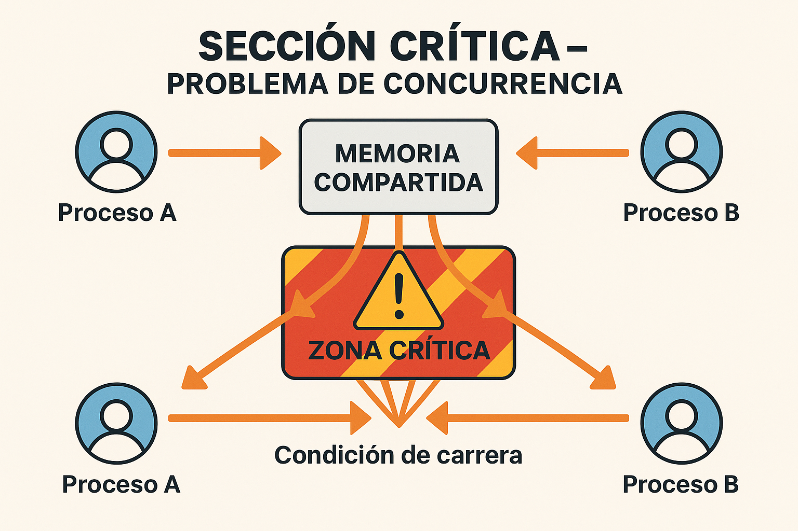
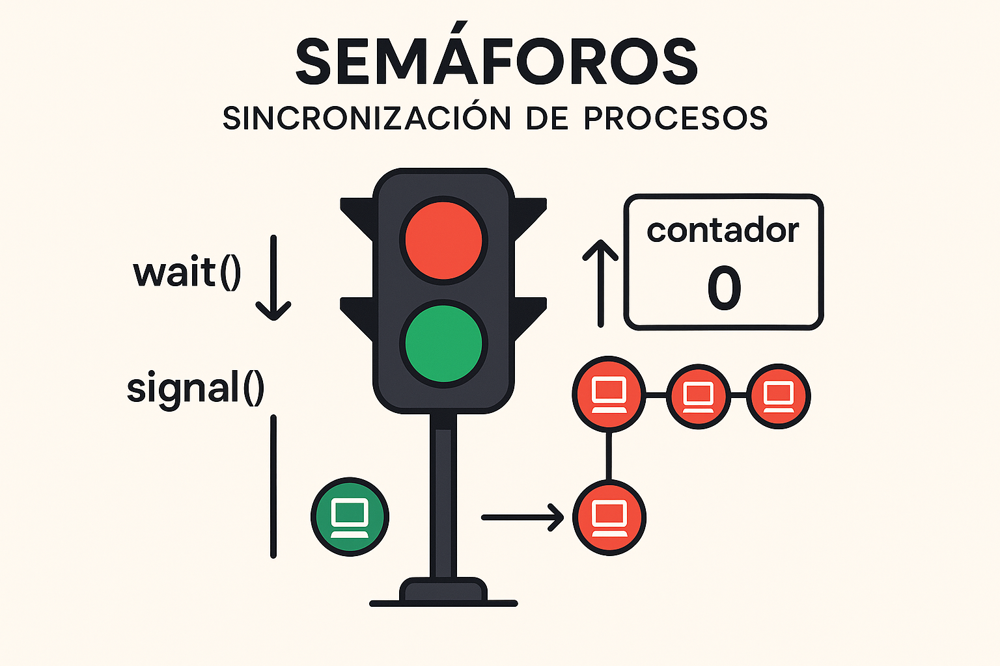

<!--
[2026-01-31] - Clase enriquecida con infografías

IMÁGENES GENERADAS:
- clase-05-seccion-critica.png: Diagrama del problema de sección crítica
- clase-05-semaforos.png: Visualización de semáforos y operaciones wait/signal
-->

# Clase 5: Sincronización de Procesos
## Sección Crítica, Semáforos y Mutex

**IF0099 - Sistemas Operativos I**
*4° Semestre - Ingeniería Informática*

---

## Objetivos de la Clase

Al finalizar esta clase, el estudiante será capaz de:

1. **Identificar** condiciones de carrera en programas concurrentes
2. **Explicar** el problema de la sección crítica
3. **Implementar** soluciones usando semáforos y mutex
4. **Resolver** el problema del productor-consumidor

**Duración:** 90 minutos

---

## El Problema de la Concurrencia

### Cuando dos procesos acceden al mismo recurso

```c
// Proceso A                    // Proceso B
saldo = leer_cuenta();          saldo = leer_cuenta();
saldo = saldo + 100;            saldo = saldo - 50;
escribir_cuenta(saldo);         escribir_cuenta(saldo);
```

**Saldo inicial: $1000**

### ¿Qué puede pasar?
- Esperado: $1000 + $100 - $50 = **$1050**
- Posible: $1100 o $950 (¡ERROR!)

---

## Condición de Carrera (Race Condition)

```
Tiempo    Proceso A              Memoria          Proceso B
──────────────────────────────────────────────────────────────
  t1      lee saldo (1000)      [saldo=1000]
  t2                            [saldo=1000]     lee saldo (1000)
  t3      suma 100 (local=1100)
  t4                                             resta 50 (local=950)
  t5      escribe 1100          [saldo=1100]
  t6                            [saldo=950]      escribe 950
──────────────────────────────────────────────────────────────
                                 RESULTADO: $950 (¡perdimos $100!)
```

### Definición:
**Race condition**: El resultado depende del orden de ejecución (no determinístico)

---

## La Sección Crítica

### Código que accede a recursos compartidos



---

### Representación ASCII del problema
```
┌────────────────────────────────────────────────────────┐
│                     PROCESO                            │
├────────────────────────────────────────────────────────┤
│   Código normal (no crítico)                           │
├────────────────────────────────────────────────────────┤
│   ┌──────────────────────────────────────────────┐    │
│   │         SECCIÓN CRÍTICA                      │    │
│   │   - Accede a variable compartida             │    │
│   │   - Modifica recurso común                   │    │
│   │   - Solo UN proceso a la vez                 │    │
│   └──────────────────────────────────────────────┘    │
├────────────────────────────────────────────────────────┤
│   Código normal (no crítico)                           │
└────────────────────────────────────────────────────────┘
```

---

## Requisitos de la Solución

### Una buena solución debe garantizar:

| Requisito | Descripción |
|-----------|-------------|
| **Exclusión mutua** | Solo un proceso en la sección crítica |
| **Progreso** | Si nadie está en SC, alguien puede entrar |
| **Espera limitada** | Un proceso no debe esperar infinitamente |

```
// Estructura general de la solución
while (true) {
    ENTRADA_SECCION_CRITICA();   // Solicitar permiso
    
    // ... sección crítica ...
    
    SALIDA_SECCION_CRITICA();    // Liberar permiso
    
    // ... resto del código ...
}
```

---

## Intento 1: Variable de turno

```c
int turno = 0;  // Variable compartida

// Proceso 0                    // Proceso 1
while (turno != 0);            while (turno != 1);
// sección crítica             // sección crítica
turno = 1;                     turno = 0;
```

### ¿Funciona?
- ✅ Exclusión mutua: Sí
- ❌ Progreso: No (alternancia estricta)

Si P0 no quiere entrar, P1 no puede entrar dos veces seguidas.

---

## Intento 2: Flags (Peterson's Algorithm)

```c
int flag[2] = {false, false};
int turno;

// Proceso i (i = 0 o 1, j = 1-i)
void entrar(int i) {
    int j = 1 - i;
    flag[i] = true;       // Quiero entrar
    turno = j;            // Doy prioridad al otro
    while (flag[j] && turno == j);  // Espero si es necesario
}

void salir(int i) {
    flag[i] = false;      // Ya no quiero estar
}
```

### ¿Funciona?
✅ Cumple los 3 requisitos (para 2 procesos)

---

## Semáforos

### Inventados por Dijkstra (1965)



---

Un **semáforo** es una variable entera con dos operaciones atómicas:

```
┌─────────────────────────────────────────────────────────┐
│  wait(S)  o  P(S)  o  down(S)                          │
│  ─────────────────────────────────────────             │
│  if (S > 0)                                            │
│      S = S - 1;                                        │
│  else                                                  │
│      bloquear proceso;                                 │
└─────────────────────────────────────────────────────────┘

┌─────────────────────────────────────────────────────────┐
│  signal(S)  o  V(S)  o  up(S)                          │
│  ─────────────────────────────────────────             │
│  if (hay procesos esperando)                           │
│      despertar uno;                                    │
│  else                                                  │
│      S = S + 1;                                        │
└─────────────────────────────────────────────────────────┘
```

---

## Tipos de Semáforos

### Semáforo Binario (Mutex)
- Valores: 0 o 1
- Usado para exclusión mutua

```c
semaphore mutex = 1;

// Proceso
wait(mutex);
// sección crítica
signal(mutex);
```

### Semáforo Contador
- Valores: 0, 1, 2, 3, ...
- Usado para controlar acceso a N recursos

```c
semaphore recursos = 5;  // 5 recursos disponibles
```

---

## Ejemplo: Exclusión Mutua con Semáforo

```c
#include <semaphore.h>

sem_t mutex;
int saldo = 1000;  // Variable compartida

void depositar(int monto) {
    sem_wait(&mutex);       // Entrada a SC
    saldo = saldo + monto;  // Sección crítica
    sem_post(&mutex);       // Salida de SC
}

void retirar(int monto) {
    sem_wait(&mutex);       // Entrada a SC
    saldo = saldo - monto;  // Sección crítica
    sem_post(&mutex);       // Salida de SC
}

int main() {
    sem_init(&mutex, 0, 1);  // Inicializar en 1
    // ... crear threads que llaman depositar/retirar ...
}
```

---

## Problema del Productor-Consumidor

### Buffer limitado compartido

```
                    BUFFER (tamaño N)
                 ┌───┬───┬───┬───┬───┐
PRODUCTOR ────→  │ X │ X │ X │   │   │ ────→ CONSUMIDOR
                 └───┴───┴───┴───┴───┘
                   0   1   2   3   4

Productor: Genera items y los pone en el buffer
Consumidor: Saca items del buffer y los usa

Problemas:
- Productor no puede poner si buffer lleno
- Consumidor no puede sacar si buffer vacío
- No pueden acceder al buffer simultáneamente
```

---

## Solución con Semáforos

```c
#define N 5  // Tamaño del buffer

sem_t mutex;     // Exclusión mutua para el buffer
sem_t empty;     // Espacios vacíos disponibles
sem_t full;      // Items disponibles

void productor() {
    while (true) {
        item = producir();
        
        sem_wait(&empty);    // Esperar espacio vacío
        sem_wait(&mutex);    // Entrar a SC
        
        buffer[in] = item;   // Poner item
        in = (in + 1) % N;
        
        sem_post(&mutex);    // Salir de SC
        sem_post(&full);     // Avisar que hay item
    }
}
```

---

## Solución (continuación)

```c
void consumidor() {
    while (true) {
        sem_wait(&full);     // Esperar item disponible
        sem_wait(&mutex);    // Entrar a SC
        
        item = buffer[out];  // Sacar item
        out = (out + 1) % N;
        
        sem_post(&mutex);    // Salir de SC
        sem_post(&empty);    // Avisar que hay espacio
        
        consumir(item);
    }
}

int main() {
    sem_init(&mutex, 0, 1);
    sem_init(&empty, 0, N);  // N espacios vacíos
    sem_init(&full, 0, 0);   // 0 items inicialmente
    // crear threads...
}
```

---

## Mutex en POSIX Threads

### pthread_mutex (más simple que semáforos)

```c
#include <pthread.h>

pthread_mutex_t lock = PTHREAD_MUTEX_INITIALIZER;
int contador = 0;

void* incrementar(void* arg) {
    for (int i = 0; i < 1000000; i++) {
        pthread_mutex_lock(&lock);    // Adquirir lock
        contador++;                    // Sección crítica
        pthread_mutex_unlock(&lock);  // Liberar lock
    }
    return NULL;
}

int main() {
    pthread_t t1, t2;
    pthread_create(&t1, NULL, incrementar, NULL);
    pthread_create(&t2, NULL, incrementar, NULL);
    pthread_join(t1, NULL);
    pthread_join(t2, NULL);
    printf("Contador: %d\n", contador);  // Siempre 2000000
}
```

---

## Deadlock (Interbloqueo)

### Cuando los procesos se bloquean mutuamente

```
Proceso A:                      Proceso B:
wait(sem1);  ← tiene sem1       wait(sem2);  ← tiene sem2
wait(sem2);  ← espera sem2      wait(sem1);  ← espera sem1
...                             ...
```

```
        ┌───────────────────────────────┐
        │                               │
        ▼                               │
   ┌─────────┐   espera    ┌─────────┐ │
   │    A    │ ──────────→ │    B    │ │
   │ (sem1)  │             │ (sem2)  │ │
   └─────────┘ ←────────── └─────────┘ │
                  espera               │
        │                               │
        └───────────────────────────────┘
                 ¡DEADLOCK!
```

---

## Condiciones para Deadlock

### Las 4 condiciones de Coffman (todas necesarias):

1. **Exclusión mutua**: Recursos no compartibles
2. **Retención y espera**: Proceso retiene recursos mientras espera otros
3. **No apropiación**: No se pueden quitar recursos por la fuerza
4. **Espera circular**: A espera a B, B espera a C, C espera a A

### Prevención: Romper al menos una condición

---

## Actividad Práctica (10 min)

### En parejas:

1. Identifiquen la sección crítica en este código:

```c
void transferir(Cuenta* origen, Cuenta* destino, int monto) {
    origen->saldo -= monto;
    destino->saldo += monto;
}
```

2. Agreguen semáforos/mutex para hacerlo thread-safe

3. ¿Puede haber deadlock si dos procesos hacen transferencias entre las mismas cuentas en direcciones opuestas?

---

## Resumen de la Clase

| Concepto | Descripción |
|----------|-------------|
| **Race condition** | Resultado depende del orden de ejecución |
| **Sección crítica** | Código que accede a recursos compartidos |
| **Semáforo** | Variable con wait/signal para sincronización |
| **Mutex** | Semáforo binario para exclusión mutua |
| **Deadlock** | Procesos bloqueados esperándose mutuamente |

---

## Evaluación (15% - Eval 2)

### Laboratorio + Sustentación: Semana 7

1. Implementar productor-consumidor en C con pthreads
2. Demostrar que funciona correctamente
3. Explicar cada semáforo y su propósito
4. **Sustentación oral** (5 min por pareja)

**Trabajo en parejas**

---

## Próxima Clase

### Clase 6: Gestión de Memoria

- Conceptos de memoria principal
- Direcciones lógicas vs físicas
- Partición de memoria
- Fragmentación

**¡Nos vemos!**
