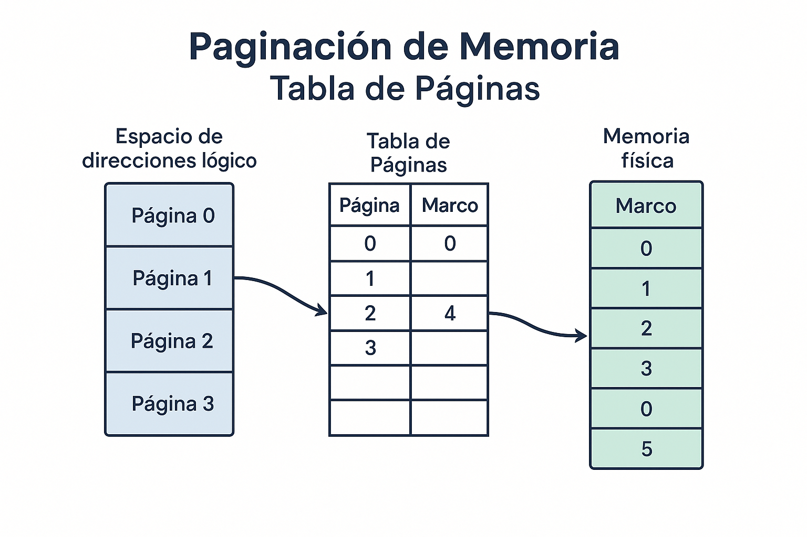

<style>
img {
  max-width: 70% !important;
  max-height: 50vh !important;
  object-fit: contain !important;
  height: auto !important;
  display: block !important;
  margin: 0 auto !important;
}
section {
  font-size: 20px;
  overflow: hidden;
}
section h1 {
  font-size: 1.8em;
}
section h2 {
  font-size: 1.4em;
}
section h3 {
  font-size: 1.2em;
}
section ul, section ol {
  font-size: 0.9em;
  margin-left: 1em;
}
section li {
  margin-bottom: 0.3em;
}
section pre {
  font-size: 0.7em;
  max-height: 60vh;
  overflow-y: auto;
}
section code {
  font-size: 0.85em;
}
section p {
  margin: 0.5em 0;
}
/* Estilos para tablas responsivas */
section table {
  width: 100%;
  max-width: 100%;
  font-size: 0.85em;
  border-collapse: collapse;
  margin: 0.5em auto;
  table-layout: auto;
}
section th {
  background-color: #1e40af;
  color: white;
  padding: 0.4em 0.6em;
  text-align: left;
  font-size: 0.9em;
  border: 1px solid #ddd;
}
section td {
  padding: 0.4em 0.6em;
  border: 1px solid #ddd;
  vertical-align: top;
  word-wrap: break-word;
  font-size: 0.85em;
}
section tbody tr:nth-child(even) {
  background-color: #f8f9fa;
}
section tbody tr:hover {
  background-color: #e9ecef;
}
/* Asegurar que el contenido no desborde */
section {
  padding: 1em 2em;
  box-sizing: border-box;
}
/* Responsividad para tablas anchas */
@media screen and (max-width: 1280px) {
  section table {
    font-size: 0.75em;
  }
  section th, section td {
    padding: 0.3em 0.4em;
  }
}
</style>


<!--
IMÁGENES GENERADAS:
- clase-07-tabla-paginas.png: Infografía sobre paginación, tabla de páginas y memoria virtual
-->

# Clase 7: Paginación y Memoria Virtual
---
## Páginas, Marcos, Tablas y Page Faults

**IF0099 - Sistemas Operativos I**
*4° Semestre - Ingeniería Informática*

{: style="max-width: 80%; max-height: 500px; display: block; margin: 0 auto;"}

---

## Objetivos de la Clase

Al finalizar esta clase, el estudiante será capaz de:

1. **Explicar** el mecanismo de paginación
2. **Traducir** direcciones usando tablas de páginas
3. **Describir** el funcionamiento de la memoria virtual
4. **Analizar** algoritmos de reemplazo de páginas

**Duración:** 90 minutos

---

## El Problema de la Fragmentación Externa

### Recordatorio de la clase anterior

```
Con asignación contigua:
┌─────┐
│  A  │
├─────┤
│HUECO│ 50KB
├─────┤
│  B  │
├─────┤
│HUECO│ 30KB     Total libre: 120KB
├─────┤          Proceso nuevo: 100KB
│  C  │          ¿Puede cargarse? NO
├─────┤
│HUECO│ 40KB
└─────┘
```

### Solución: **Paginación**
¡No necesitamos memoria contigua!

---

## Idea de la Paginación

### Dividir memoria en bloques de tamaño fijo

```
MEMORIA LÓGICA (Proceso)          MEMORIA FÍSICA
      PÁGINAS                         MARCOS
┌─────────────┐                 ┌─────────────┐ Marco 0
│   Página 0  │                 │   Página 2  │
├─────────────┤                 ├─────────────┤ Marco 1
│   Página 1  │                 │   Página 0  │
├─────────────┤                 ├─────────────┤ Marco 2
│   Página 2  │                 │    (libre)  │
├─────────────┤                 ├─────────────┤ Marco 3
│   Página 3  │                 │   Página 3  │
└─────────────┘                 ├─────────────┤ Marco 4
                                │   Página 1  │
                                └─────────────┘
```

**Página** = Bloque de memoria lógica
**Marco** = Bloque de memoria física
**Tamaño típico:** 4KB (4096 bytes)

---

## Traducción de Direcciones

### Dirección lógica = Número de página + Desplazamiento

```
Dirección lógica: 5000 (en bytes)
Tamaño de página: 4096 bytes

Número de página = 5000 / 4096 = 1
Desplazamiento   = 5000 % 4096 = 904

         TABLA DE PÁGINAS
        ┌───────┬────────┐
        │Página │ Marco  │
        ├───────┼────────┤
        │   0   │   1    │
        │   1   │   4    │ ← Página 1 está en Marco 4
        │   2   │   0    │
        │   3   │   3    │
        └───────┴────────┘

Dirección física = Marco 4 × 4096 + 904 = 16384 + 904 = 17288
```

---

## Diagrama de Traducción

```
        DIRECCIÓN LÓGICA
    ┌────────────┬──────────────┐
    │ # Página   │ Desplazamiento│
    │    (p)     │     (d)       │
    └─────┬──────┴───────┬───────┘
          │              │
          ▼              │
    ┌───────────┐        │
    │  TABLA    │        │
    │    DE     │        │
    │  PÁGINAS  │        │
    └─────┬─────┘        │
          │              │
          ▼              ▼
    ┌────────────┬──────────────┐
    │ # Marco    │ Desplazamiento│
    │    (f)     │     (d)       │
    └────────────┴──────────────┘
        DIRECCIÓN FÍSICA
```

---

## Ejemplo Completo

```
Memoria física: 64 KB (16 marcos de 4 KB)
Proceso: 16 KB (4 páginas de 4 KB)

Tabla de páginas del proceso:
┌───────┬────────┬────────┐
│Página │ Marco  │ Válido │
├───────┼────────┼────────┤
│   0   │   5    │   1    │
│   1   │   9    │   1    │
│   2   │   2    │   1    │
│   3   │  12    │   1    │
└───────┴────────┴────────┘

Traducir dirección lógica: 8500

Página = 8500 / 4096 = 2
Desplazamiento = 8500 % 4096 = 308

Marco de página 2 = 2
Dirección física = 2 × 4096 + 308 = 8500 ✓
```

---

## Ventajas de la Paginación

### ✅ Elimina fragmentación externa

```
ANTES (contigua):               DESPUÉS (paginación):
┌─────┐                         ┌─────┐ Marco 0: P1.pág0
│  A  │                         ├─────┤ Marco 1: P2.pág0
├─────┤                         ├─────┤ Marco 2: P1.pág1
│HUECO│ No podemos usar         ├─────┤ Marco 3: P3.pág0
├─────┤                         ├─────┤ Marco 4: P2.pág1
│  B  │                         ├─────┤ Marco 5: P1.pág2
├─────┤                         └─────┘
│HUECO│ estos espacios          
├─────┤ para P4                  P4 puede usar marcos
│  C  │                          no contiguos!
└─────┘
```

### ⚠️ Aún puede haber fragmentación interna
(Si un proceso no usa toda su última página)

---

## Memoria Virtual

### Más memoria de la que físicamente existe

```
    MEMORIA VIRTUAL                    MEMORIA FÍSICA
    (por proceso)                         (real)
┌─────────────────┐                 ┌─────────────────┐
│                 │                 │                 │
│   4 GB          │                 │   8 GB          │
│   de espacio    │ ──parcialmente──│   compartida    │
│   de direcciones│     cargada     │   entre todos   │
│                 │                 │   los procesos  │
└─────────────────┘                 └─────────────────┘

Cada proceso CREE que tiene 4GB
Solo las páginas en uso están en RAM
El resto está en DISCO (swap)
```

---

## Demand Paging (Paginación por Demanda)

### Solo cargar páginas cuando se necesitan

```
1. Proceso intenta acceder a dirección
2. Buscar en tabla de páginas
3. Si válido=1 → página en RAM → acceder
4. Si válido=0 → PAGE FAULT:
   a. Buscar página en disco
   b. Cargar en marco libre
   c. Actualizar tabla de páginas
   d. Reintentar acceso

┌───────┬────────┬────────┐
│Página │ Marco  │ Válido │
├───────┼────────┼────────┤
│   0   │   5    │   1    │ ← En RAM
│   1   │   -    │   0    │ ← En disco (page fault si se accede)
│   2   │   2    │   1    │ ← En RAM
│   3   │   -    │   0    │ ← En disco
└───────┴────────┴────────┘
```

---

## Page Fault (Fallo de Página)

### Diagrama del proceso

```
┌─────────────────────────────────────────────────────────────┐
│  1. CPU genera dirección lógica                             │
│                    ↓                                        │
│  2. MMU consulta tabla de páginas                           │
│                    ↓                                        │
│  3. Bit válido = 0 → TRAP (page fault)                      │
│                    ↓                                        │
│  4. SO busca página en disco (swap)                         │
│                    ↓                                        │
│  5. SO elige un marco (puede requerir reemplazo)            │
│                    ↓                                        │
│  6. SO carga página del disco al marco                      │
│                    ↓                                        │
│  7. SO actualiza tabla de páginas (válido=1)                │
│                    ↓                                        │
│  8. Se reinicia la instrucción                              │
└─────────────────────────────────────────────────────────────┘
```

---

## Algoritmos de Reemplazo de Páginas

### Cuando no hay marcos libres, ¿cuál página sacar?

| Algoritmo | Descripción | Optimalidad |
| ----------- | ------------- | ------------- |
| **FIFO** | Primera en entrar, primera en salir | Simple pero malo |
| **Óptimo** | Sacar la que se usará más tarde | Imposible de implementar |
| **LRU** | Least Recently Used (menos usada recientemente) | Bueno pero costoso |
| **Clock** | Aproximación a LRU con bit de referencia | Práctico |

---

## Ejemplo: FIFO

```
| Marcos: 3 | Secuencia de páginas: 1, 2, 3, 4, 1, 2, 5, 1, 2, 3, 4, 5 |

Paso │ Página │ Marco1 │ Marco2 │ Marco3 │ Page Fault?
─────┼────────┼────────┼────────┼────────┼────────────
  1  │   1    │   1    │        │        │    ✓
  2  │   2    │   1    │   2    │        │    ✓
  3  │   3    │   1    │   2    │   3    │    ✓
  4  │   4    │   4    │   2    │   3    │    ✓ (sale 1)
  5  │   1    │   4    │   1    │   3    │    ✓ (sale 2)
  6  │   2    │   4    │   1    │   2    │    ✓ (sale 3)
  7  │   5    │   5    │   1    │   2    │    ✓ (sale 4)
  8  │   1    │   5    │   1    │   2    │    ✗
  9  │   2    │   5    │   1    │   2    │    ✗
 10  │   3    │   5    │   3    │   2    │    ✓ (sale 1)
 11  │   4    │   5    │   3    │   4    │    ✓ (sale 2)
 12  │   5    │   5    │   3    │   4    │    ✗

Page Faults: 9
```

---

## Ejemplo: LRU

```
| Marcos: 3 | Secuencia de páginas: 1, 2, 3, 4, 1, 2, 5, 1, 2, 3, 4, 5 |

Paso │ Página │ Marco1 │ Marco2 │ Marco3 │ Page Fault? │ Orden LRU
─────┼────────┼────────┼────────┼────────┼─────────────┼──────────
  1  │   1    │   1    │        │        │    ✓        │ 1
  2  │   2    │   1    │   2    │        │    ✓        │ 1,2
  3  │   3    │   1    │   2    │   3    │    ✓        │ 1,2,3
  4  │   4    │   4    │   2    │   3    │    ✓        │ 2,3,4 (1 era LRU)
  5  │   1    │   4    │   1    │   3    │    ✓        │ 3,4,1 (2 era LRU)
  6  │   2    │   4    │   1    │   2    │    ✓        │ 4,1,2 (3 era LRU)
  7  │   5    │   5    │   1    │   2    │    ✓        │ 1,2,5 (4 era LRU)
  8  │   1    │   5    │   1    │   2    │    ✗        │ 2,5,1
  9  │   2    │   5    │   1    │   2    │    ✗        │ 5,1,2
 10  │   3    │   3    │   1    │   2    │    ✓        │ 1,2,3 (5 era LRU)
 11  │   4    │   3    │   4    │   2    │    ✓        │ 2,3,4 (1 era LRU)
 12  │   5    │   3    │   4    │   5    │    ✓        │ 3,4,5 (2 era LRU)

Page Faults: 10 (¡más que FIFO en este caso!)
```

---

## Thrashing

### Cuando el sistema pasa más tiempo haciendo page faults que ejecutando

```
     Utilización
     de CPU
        │
    100%│          ┌────────────────
        │         /
        │        /
        │       /
        │      /
        │     /
        │    /         THRASHING
        │   / ──────────────────────
        │  /           ▼
      0 │─┴─────────────────────────────
        └──────────────────────────────→
                Grado de multiprogramación
                   (# de procesos)
```

**Causa:** Demasiados procesos compitiendo por pocos marcos

---

## Working Set (Conjunto de Trabajo)

### Páginas activamente usadas por un proceso

```
Si un proceso usa las páginas: 1, 2, 1, 3, 2, 1, 4, 1, 2, 3

En una ventana de tiempo Δ=4:
Posición 10: páginas usadas en posiciones 7-10 = {4, 1, 2, 3}
Working Set = {1, 2, 3, 4}  (4 páginas)

El SO debe asegurar que el proceso tenga al menos
4 marcos para evitar thrashing.
```

---

## TLB (Translation Lookaside Buffer)

### Caché de traducciones de páginas

```
Sin TLB:
CPU → Tabla de páginas (RAM) → Memoria física (RAM)
      ↑ Lento (2 accesos a RAM)

Con TLB:
CPU → TLB (caché) → Si hit: Memoria física (1 acceso)
         ↓
    Si miss: Tabla de páginas → actualizar TLB
```

**TLB típico:** 64-1024 entradas, tiempo de acceso ~1 ns

---


---

## Ejercicio Resuelto: Traducción Completa

### Datos:
- Memoria física: 32 KB (8 marcos de 4 KB)
- Proceso con 3 páginas
- Tabla de páginas: P0→M5, P1→M2, P2→M7

```
Traducir las siguientes direcciones lógicas:
1) 2048
2) 5000  
3) 10240

SOLUCIÓN:
Tamaño de página = 4096 bytes

1) Dirección 2048:
   Página = 2048 / 4096 = 0
   Desplazamiento = 2048 % 4096 = 2048
   Marco = 5 (desde tabla)
   Dir. Física = 5 × 4096 + 2048 = 22528 ✓

2) Dirección 5000:
   Página = 5000 / 4096 = 1
   Desplazamiento = 5000 % 4096 = 904
   Marco = 2 (desde tabla)
   Dir. Física = 2 × 4096 + 904 = 9096 ✓

3) Dirección 10240:
   Página = 10240 / 4096 = 2
   Desplazamiento = 10240 % 4096 = 2048
   Marco = 7 (desde tabla)
   Dir. Física = 7 × 4096 + 2048 = 30720 ✓
```

---

## Working Set: Ejemplo Detallado

### Secuencia de referencias a páginas:
```
1 2 3 4 1 2 5 1 2 3 4 5 | Ventana Δ=4

Posición  Referencias       Working Set    Tamaño
   4:     {1, 2, 3, 4}     {1, 2, 3, 4}      4
   5:     {2, 3, 4, 1}     {1, 2, 3, 4}      4
   6:     {3, 4, 1, 2}     {1, 2, 3, 4}      4
   7:     {4, 1, 2, 5}     {1, 2, 4, 5}      4
   8:     {1, 2, 5, 1}     {1, 2, 5}         3
   9:     {2, 5, 1, 2}     {1, 2, 5}         3
  10:     {5, 1, 2, 3}     {1, 2, 3, 5}      4
```

**Observación:** El proceso necesita al menos 4 marcos para
evitar thrashing en este patrón de acceso.


---

## Ejercicio Resuelto: Traducción Completa

### Datos:
- Memoria física: 32 KB (8 marcos de 4 KB)
- Proceso con 3 páginas
- Tabla de páginas: P0→M5, P1→M2, P2→M7

```
Traducir las siguientes direcciones lógicas:
1) 2048
2) 5000  
3) 10240

SOLUCIÓN:
Tamaño de página = 4096 bytes

1) Dirección 2048:
   Página = 2048 / 4096 = 0
   Desplazamiento = 2048 % 4096 = 2048
   Marco = 5 (desde tabla)
   Dir. Física = 5 × 4096 + 2048 = 22528 ✓

2) Dirección 5000:
   Página = 5000 / 4096 = 1
   Desplazamiento = 5000 % 4096 = 904
   Marco = 2 (desde tabla)
   Dir. Física = 2 × 4096 + 904 = 9096 ✓

3) Dirección 10240:
   Página = 10240 / 4096 = 2
   Desplazamiento = 10240 % 4096 = 2048
   Marco = 7 (desde tabla)
   Dir. Física = 7 × 4096 + 2048 = 30720 ✓
```

---

## Working Set: Ejemplo Detallado

### Secuencia de referencias a páginas:
```
1 2 3 4 1 2 5 1 2 3 4 5 | Ventana Δ=4

Posición  Referencias       Working Set    Tamaño
   4:     {1, 2, 3, 4}     {1, 2, 3, 4}      4
   5:     {2, 3, 4, 1}     {1, 2, 3, 4}      4
   6:     {3, 4, 1, 2}     {1, 2, 3, 4}      4
   7:     {4, 1, 2, 5}     {1, 2, 4, 5}      4
   8:     {1, 2, 5, 1}     {1, 2, 5}         3
   9:     {2, 5, 1, 2}     {1, 2, 5}         3
  10:     {5, 1, 2, 3}     {1, 2, 3, 5}      4
```

**Observación:** El proceso necesita al menos 4 marcos para
evitar thrashing en este patrón de acceso.

## Actividad Práctica (10 min)

### En parejas:

**Dado:**
- 3 marcos disponibles
- Secuencia de páginas: 7, 0, 1, 2, 0, 3, 0, 4, 2, 3, 0, 3

**Calcular page faults usando:**
1. FIFO
2. LRU

**Comparar resultados y discutir.**

---

## Resumen de la Clase

| Concepto | Descripción |
| ---------- | ------------- |
| **Página** | Bloque de memoria lógica (ej: 4KB) |
| **Marco** | Bloque de memoria física |
| **Page Fault** | Acceso a página no cargada |
| **Demand Paging** | Cargar páginas solo cuando se necesitan |
| **TLB** | Caché de traducciones |
| **Thrashing** | Exceso de page faults |

---

## Evaluación (20% - Eval 3)

### Proyecto: Simulador de Paginación - Semana 10

1. Implementar simulador en Python/C
2. Soportar FIFO y LRU
3. Mostrar estadísticas de page faults
4. **Sustentación oral** (10 min por pareja)

**Trabajo en parejas**

---

## Próxima Clase

### Clase 8: Sistemas de Archivos

- Concepto de archivo y atributos
- Operaciones sobre archivos
- Estructura de directorios
- FAT, NTFS, ext4

**¡Nos vemos!**
