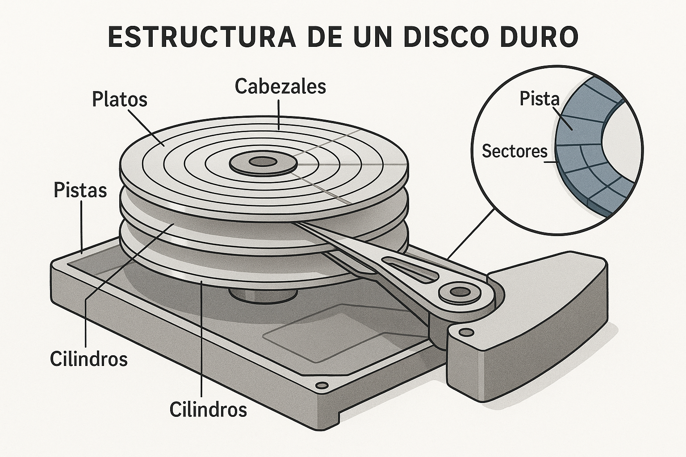

<style>
img {
  max-width: 65% !important;
  max-height: 45vh !important;
  object-fit: contain !important;
  height: auto !important;
}
section {
  font-size: 24px;
}
</style>


<!--
IMÁGENES GENERADAS:
- clase-08-estructura-disco.png: Infografía sobre estructura de disco duro y algoritmos de planificación
-->

# Clase 8: Memoria Secundaria y Discos
## Estructura, planificación y rendimiento

**IF0099 - Sistemas Operativos I**
*4° Semestre - Ingeniería Informática*

{: style="max-width: 80%; max-height: 500px; display: block; margin: 0 auto;"}

---

## Objetivos de la Clase

Al finalizar esta clase, el estudiante será capaz de:

1. **Describir** la estructura física de un disco
2. **Explicar** el tiempo de acceso y sus componentes
3. **Comparar** algoritmos de planificación de discos
4. **Evaluar** estrategias de optimización y caching

**Duración:** 90 minutos

---

## Agenda

1. Estructura de discos (15 min)
2. Tiempo de acceso y rendimiento (15 min)
3. Algoritmos de planificación (30 min)
4. RAID y almacenamiento moderno (20 min)
5. Actividad práctica (10 min)

---

## 1. Estructura de un Disco

```
Platos ─► Pistas ─► Sectores

┌───────────────┐
│   PLATO 0     │
│ ┌───────────┐ │
│ │  PISTA 0  │ │
│ │  PISTA 1  │ │
│ │  PISTA 2  │ │
│ └───────────┘ │
└───────────────┘
```

- **Pista:** circunferencia concéntrica
- **Sector:** porción de una pista (unidad mínima)
- **Cabezal:** lee/escribe sobre la superficie
- **Cilindro:** conjunto de pistas alineadas entre platos

---

## 2. Tiempo de Acceso

**Tiempo total = seek + latencia + transferencia**

| Componente | Descripción |
|-----------|-------------|
| **Seek** | Mover cabezal a la pista correcta |
| **Latencia rotacional** | Esperar que el sector gire hasta el cabezal |
| **Transferencia** | Leer/escribir datos |

```
Ejemplo: 8ms (seek) + 4ms (latencia) + 1ms (transfer) = 13ms
```

---

## 3. Algoritmos de Planificación de Discos

### FCFS (First-Come, First-Served)
- Simple, pero puede ser ineficiente

### SSTF (Shortest Seek Time First)
- Minimiza el movimiento del cabezal
- Puede causar starvation

### SCAN (Elevator)
- Cabezal se mueve en una dirección y luego regresa

### C-SCAN
- Solo atiende en una dirección

---

## Ejemplo Visual (SCAN)

```
Solicitudes: 98, 183, 37, 122, 14, 124, 65, 67
Cabezal inicia en 53

Movimiento (SCAN): 53 → 65 → 67 → 98 → 122 → 124 → 183 → (regresa) → 37 → 14
```

**Ventaja:** tiempo de espera más uniforme

---

## 4. RAID y Almacenamiento Moderno

| Tipo | Descripción | Beneficio |
|------|-------------|-----------|
| **RAID 0** | Striping | Velocidad (sin redundancia) |
| **RAID 1** | Mirroring | Redundancia |
| **RAID 5** | Paridad distribuida | Balance rendimiento/seguridad |
| **RAID 10** | 0 + 1 | Rendimiento y redundancia |

**SSD:** sin partes mecánicas, menor latencia

---

## Actividad Práctica (10 min)

### En parejas:

**Linux:**
```bash
lsblk
sudo hdparm -t /dev/sda
```

**Windows (PowerShell):**
```powershell
Get-Disk
Get-PhysicalDisk
```

**Pregunta:** ¿Qué tipo de disco usa tu equipo y cómo afecta el rendimiento?

---

## Resumen de la Clase

| Concepto | Idea clave |
|----------|------------|
| **Disco** | Pistas, sectores, cabezales |
| **Tiempo de acceso** | Seek + latencia + transferencia |
| **Planificación** | FCFS, SSTF, SCAN, C-SCAN |
| **RAID** | Redundancia y rendimiento |

---

## Tarea

1. Comparar SSD vs HDD (3 diferencias técnicas)
2. Explicar por qué SCAN reduce el tiempo promedio
3. Investigar qué RAID usa un data center moderno

---

## Próxima Clase

### Clase 11: Implementación de Sistemas de Archivos

- Estructuras internas
- Inodos y bloques
- Ejemplo ext4

**¡Nos vemos!**
