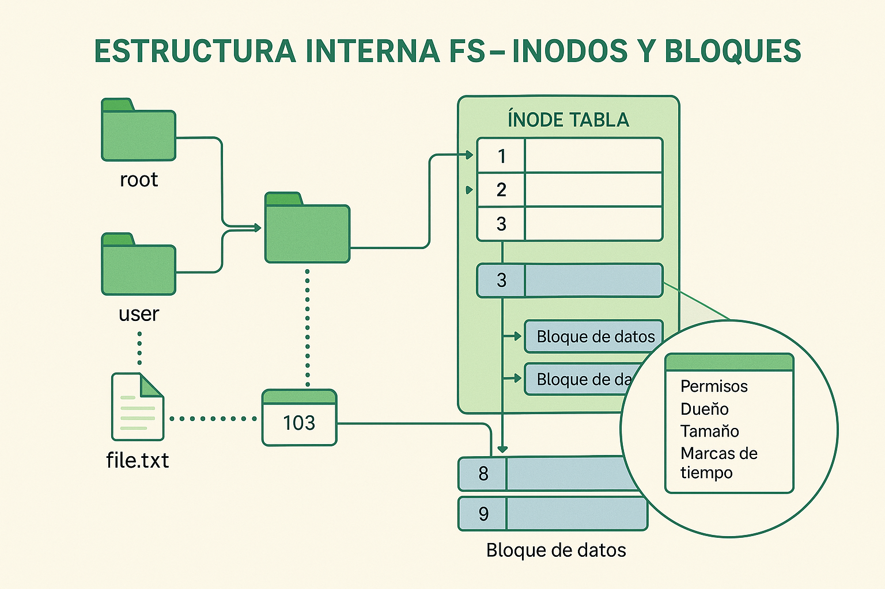

<style>
img {
  max-width: 70% !important;
  max-height: 50vh !important;
  object-fit: contain !important;
  height: auto !important;
  display: block !important;
  margin: 0 auto !important;
}
section {
  font-size: 20px;
  overflow: hidden;
}
section h1 {
  font-size: 1.8em;
}
section h2 {
  font-size: 1.4em;
}
section h3 {
  font-size: 1.2em;
}
section ul, section ol {
  font-size: 0.9em;
  margin-left: 1em;
}
section li {
  margin-bottom: 0.3em;
}
section pre {
  font-size: 0.7em;
  max-height: 60vh;
  overflow-y: auto;
}
section code {
  font-size: 0.85em;
}
section p {
  margin: 0.5em 0;
}
/* Estilos para tablas responsivas */
section table {
  width: 100%;
  max-width: 100%;
  font-size: 0.85em;
  border-collapse: collapse;
  margin: 0.5em auto;
  table-layout: auto;
}
section th {
  background-color: #1e40af;
  color: white;
  padding: 0.4em 0.6em;
  text-align: left;
  font-size: 0.9em;
  border: 1px solid #ddd;
}
section td {
  padding: 0.4em 0.6em;
  border: 1px solid #ddd;
  vertical-align: top;
  word-wrap: break-word;
  font-size: 0.85em;
}
section tbody tr:nth-child(even) {
  background-color: #f8f9fa;
}
section tbody tr:hover {
  background-color: #e9ecef;
}
/* Asegurar que el contenido no desborde */
section {
  padding: 1em 2em;
  box-sizing: border-box;
}
/* Responsividad para tablas anchas */
@media screen and (max-width: 1280px) {
  section table {
    font-size: 0.75em;
  }
  section th, section td {
    padding: 0.3em 0.4em;
  }
}
</style>


<!--
IMÁGENES GENERADAS:
- clase-11-inodos.png: Infografía sobre implementación de sistemas de archivos con inodos
-->

# Clase 11: Implementación de Sistemas de Archivos
---
## Inodos, bloques y estructuras internas

**IF0099 - Sistemas Operativos I**
*4° Semestre - Ingeniería Informática*

{: style="max-width: 80%; max-height: 500px; display: block; margin: 0 auto;"}

---

## Objetivos de la Clase

Al finalizar esta clase, el estudiante será capaz de:

1. **Explicar** la estructura interna de un sistema de archivos
2. **Describir** el rol de inodos, directorios y bloques
3. **Analizar** la asignación de espacio (contigua, enlazada, indexada)
4. **Relacionar** el diseño con el rendimiento

**Duración:** 90 minutos

---

## Agenda

1. Estructuras de un FS (20 min)
2. Inodos y metadatos (20 min)
3. Asignación de espacio (25 min)
4. Caso ext4 (15 min)
5. Actividad práctica (10 min)

---

## 1. Estructura Interna del FS

```
┌──────────────────────────────────────┐
│ Superblock                           │
├──────────────────────────────────────┤
│ Bitmaps (bloques / inodos libres)    │
├──────────────────────────────────────┤
│ Tabla de Inodos                      │
├──────────────────────────────────────┤
│ Bloques de Datos                     │
└──────────────────────────────────────┘
```

- **Superblock:** tamaño, FS, estado, conteos
- **Bitmaps:** qué está libre/ocupado
- **Inodos:** metadatos de archivos
- **Datos:** contenido real

---

## 2. ¿Qué es un Inodo?

```
INODO:
- Permisos (rwx)
- Propietario / grupo
- Tamaño
- Timestamps (atime, mtime, ctime)
- Punteros a bloques de datos
```

**Regla clave:** El nombre del archivo está en el directorio, no en el inodo.

---

## Directorios como Tablas

```
Directorio:
+----------------------+---------+
|  | Nombre | Inodo |  |
+----------------------+---------+
| documento.txt | 1052 |
| foto.jpg | 2048 |
| proyecto/ | 3021 |
+----------------------+---------+
```

- Directorio = archivo especial
- Mapea nombre → inodo

---

## 3. Asignación de Espacio

### Contigua
- Rápida, pero difícil de expandir

### Enlazada
- Fácil crecer, acceso lento

### Indexada
- Acceso directo, usa bloques índice

```
[Inodo] -> [Bloque índice] -> [Bloques de datos]
```

---

## 4. Ejemplo ext4 (Linux)

- **Journaling** para consistencia
- **Extents** para reducir fragmentación
- **Bloques** típicos: 4KB

**Ventaja:** rápido y confiable en servidores

---

## Actividad Práctica (10 min)

### En parejas (Linux):
```bash
ls -li
stat archivo.txt
```

Preguntas:
1. ¿Cuál es el inodo del archivo?
2. ¿Qué metadatos muestra `stat`?

---

## Resumen de la Clase

| Concepto | Idea clave |
| ---------- | ------------ |
| **Superblock** | Información global del FS |
| **Inodo** | Metadatos y punteros a datos |
| **Directorio** | Tabla nombre → inodo |
| **Asignación** | Contigua, enlazada, indexada |
| **ext4** | Journaling y extents |

---

## Tarea

1. Comparar FAT32 vs ext4 (3 diferencias)
2. Explicar qué es journaling y por qué ayuda

---

## Próxima Clase

### Clase 13: Sistemas Distribuidos

- Conceptos básicos
- Ventajas y retos
- Ejemplos reales

**¡Nos vemos!**
