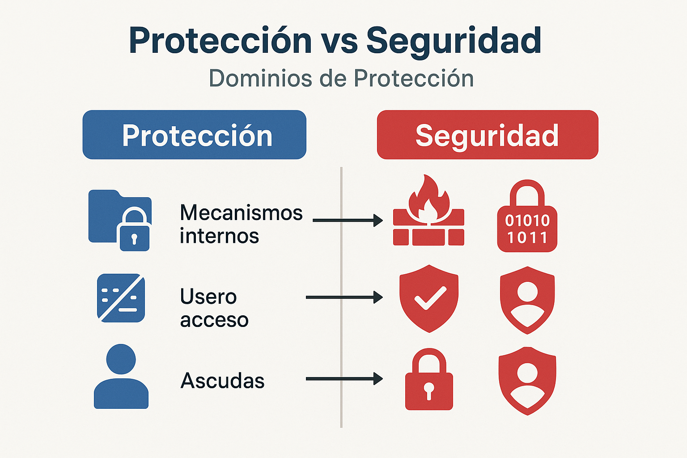

<style>
img {
  max-width: 65% !important;
  max-height: 45vh !important;
  object-fit: contain !important;
  height: auto !important;
}
section {
  font-size: 24px;
}
</style>


<!--
IMÁGENES GENERADAS:
- clase-12-proteccion-seguridad.png: Infografía sobre protección y seguridad en sistemas operativos
-->

# Clase 12: Protección y Seguridad
## Dominios, Control de Acceso y Amenazas

**IF0099 - Sistemas Operativos I**
*4° Semestre - Ingeniería Informática*

{: style="max-width: 80%; max-height: 500px; display: block; margin: 0 auto;"}

---

## Objetivos de la Clase

Al finalizar esta clase, el estudiante será capaz de:

1. **Diferenciar** protección de seguridad
2. **Explicar** los dominios de protección
3. **Describir** mecanismos de control de acceso
4. **Identificar** amenazas comunes y defensas

**Duración:** 90 minutos

---

## Protección vs Seguridad

```
┌─────────────────────────────────────────────────────────────┐
│                      PROTECCIÓN                             │
│  "Mecanismo interno del SO para controlar acceso            │
│   de procesos/usuarios a recursos"                          │
│                                                             │
│  • Control de acceso a archivos                             │
│  • Separación de memoria entre procesos                     │
│  • Permisos de ejecución                                    │
└─────────────────────────────────────────────────────────────┘

┌─────────────────────────────────────────────────────────────┐
│                       SEGURIDAD                             │
│  "Garantizar que el sistema funcione según lo previsto      │
│   frente a amenazas internas y externas"                    │
│                                                             │
│  • Autenticación de usuarios                                │
│  • Cifrado de datos                                         │
│  • Defensa contra malware                                   │
│  • Auditoría y logs                                         │
└─────────────────────────────────────────────────────────────┘
```

---

## Principios de Protección

### 1. Principio de Mínimo Privilegio

```
                     MAL                          BIEN
           ┌─────────────────────┐     ┌─────────────────────┐
           │ Proceso Web Server  │     │ Proceso Web Server  │
           │                     │     │                     │
           │ Permisos: root      │     │ Permisos:           │
           │ (acceso a TODO)     │     │ - Leer /var/www     │
           │                     │     │ - Escribir /var/log │
           │ Si es comprometido: │     │ - Puerto 80/443     │
           │ ¡Control total!     │     │                     │
           └─────────────────────┘     │ Si es comprometido: │
                                       │ Daño limitado       │
                                       └─────────────────────┘
```

> "Un proceso debe tener exactamente los privilegios que necesita
> para realizar su tarea, nada más."

---

## Dominios de Protección

### Dominio = Conjunto de derechos de acceso

```
                      OBJETOS
              ┌─────┬─────┬─────┬─────┐
              │ F1  │ F2  │ F3  │ Imp │
┌─────────────┼─────┼─────┼─────┼─────┤
│ Dominio D0  │ R   │ RW  │     │     │  ← Usuario común
├─────────────┼─────┼─────┼─────┼─────┤
│ Dominio D1  │ RWX │ R   │ RW  │     │  ← Desarrollador
├─────────────┼─────┼─────┼─────┼─────┤
│ Dominio D2  │ RWX │ RWX │ RWX │ W   │  ← Administrador
└─────────────┴─────┴─────┴─────┴─────┘

R = Leer    W = Escribir    X = Ejecutar
F1, F2, F3 = Archivos       Imp = Impresora
```

Un proceso ejecuta en un dominio.
Un usuario puede tener múltiples dominios.

---

## Matriz de Acceso

### Implementación de dominios

```
            MATRIZ DE ACCESO (Conceptual)
         ┌────────┬────────┬────────┬────────┬────────┐
         │ /etc/  │ /home/ │ /var/  │ Printer│ D1     │
         │ passwd │ juan   │ log    │        │        │
┌────────┼────────┼────────┼────────┼────────┼────────┤
│ D0     │ R      │        │        │        │ switch │
│ (juan) │        │ RWX    │ R      │ W      │        │
├────────┼────────┼────────┼────────┼────────┼────────┤
│ D1     │ RW     │ RWX    │ RW     │ W      │        │
│ (root) │        │        │        │        │        │
└────────┴────────┴────────┴────────┴────────┴────────┘

"switch" = puede cambiar a otro dominio (ej: sudo)
```

**Problema:** Matriz muy grande y dispersa
**Solución:** No almacenarla completa

---

## Implementación: ACL vs Capabilities

### ACL (Access Control Lists) - Por objeto

```
Archivo: /etc/passwd
┌────────────────────────────────┐
│  ACL:                          │
│  - juan: R                     │
│  - maria: R                    │
│  - root: RW                    │
│  - grupo admin: RW             │
└────────────────────────────────┘

Ventaja: Fácil ver quién accede a un archivo
Desventaja: Difícil ver a qué accede un usuario
```

### Capabilities - Por dominio/proceso

```
Proceso: usuario juan
┌────────────────────────────────┐
│  Capabilities:                 │
│  - /etc/passwd: R              │
│  - /home/juan/*: RWX           │
│  - /var/log: R                 │
└────────────────────────────────┘

Ventaja: Fácil ver permisos de un proceso
Desventaja: Difícil auditar un archivo
```

---

## Permisos en Unix/Linux

### Modelo UGO (User, Group, Others)

```
$ ls -l archivo.txt
-rw-r--r-- 1 juan developers 1024 Feb 15 10:30 archivo.txt
 │││││││││   │     │
 │││││││││   │     └── grupo propietario
 │││││││││   └──────── usuario propietario
 │││││││││
 ││││││└┴┴── others: r-- (solo lectura)
 │││└┴┴───── group: r-- (solo lectura)
 └┴┴──────── user: rw- (lectura y escritura)
 │
 └────────── tipo: - (archivo regular)

Notación octal: 644
  6 (rw-) = 4+2+0 = 110 binario
  4 (r--) = 4+0+0 = 100 binario
  4 (r--) = 4+0+0 = 100 binario
```

---

## Permisos Especiales en Linux

### SUID, SGID, Sticky Bit

```
SUID (Set User ID):
-rwsr-xr-x 1 root root /usr/bin/passwd
    ^
    El proceso ejecuta con permisos del PROPIETARIO (root)
    Permite a usuarios cambiar su password en /etc/shadow

SGID (Set Group ID):
drwxrws--- 2 juan proyecto /proyecto/
       ^
       Nuevos archivos heredan el grupo del directorio

Sticky Bit:
drwxrwxrwt 10 root root /tmp/
          ^
          Solo el propietario puede borrar sus archivos
          (aunque /tmp sea escribible por todos)
```

---

## Control de Acceso en Windows

### ACL Discrecional (DACL)

```
Archivo: C:\Documentos\reporte.docx
┌─────────────────────────────────────────────────────────┐
│  Security Descriptor                                    │
│  ├── Owner: DOMAIN\juan                                 │
│  ├── Group: DOMAIN\Users                                │
│  └── DACL:                                              │
│      ├── DOMAIN\juan: Full Control                      │
│      ├── DOMAIN\Managers: Read, Write                   │
│      ├── DOMAIN\Users: Read                             │
│      └── Everyone: (denegado)                           │
└─────────────────────────────────────────────────────────┘

Permisos granulares:
- Read, Write, Execute
- Read Attributes, Write Attributes
- Delete, Change Permissions
- Take Ownership
```

---

## Amenazas de Seguridad

```
┌─────────────────────────────────────────────────────────────┐
│                    TIPOS DE AMENAZAS                        │
├─────────────────────────────────────────────────────────────┤
│                                                             │
│  MALWARE                    ATAQUES DE RED                  │
│  ├── Virus                  ├── Man-in-the-middle           │
│  ├── Worm (gusano)          ├── DoS/DDoS                    │
│  ├── Trojan                 ├── SQL Injection               │
│  ├── Ransomware             └── Phishing                    │
│  ├── Spyware                                                │
│  └── Rootkit                ATAQUES LOCALES                 │
│                             ├── Privilege escalation        │
│  INGENIERÍA SOCIAL          ├── Buffer overflow             │
│  ├── Phishing               └── Keylogger                   │
│  └── Pretexting                                             │
│                                                             │
└─────────────────────────────────────────────────────────────┘
```

---

## Amenaza: Buffer Overflow

### Cómo funciona

```c
void funcion_vulnerable(char *entrada) {
    char buffer[64];
    strcpy(buffer, entrada);  // ¡No verifica tamaño!
}

STACK:                           STACK DESPUÉS DEL ATAQUE:
┌───────────────────┐            ┌───────────────────┐
│ Dirección retorno │            │ Dirección maliciosa│ ← Sobrescrito
├───────────────────┤            ├───────────────────┤
│ Variables locales │            │   Código malicioso│
├───────────────────┤            ├───────────────────┤
│   buffer[64]      │            │   AAAAAAAAAAAAA...│
└───────────────────┘            └───────────────────┘

Entrada: 100+ bytes incluyendo dirección a código malicioso
```

**Defensa:** Stack canaries, ASLR, NX bit, funciones seguras

---

## Mecanismos de Defensa

| Mecanismo | Descripción | Protege contra |
|-----------|-------------|----------------|
| **Autenticación** | Verificar identidad | Acceso no autorizado |
| **Cifrado** | Datos ilegibles sin clave | Intercepción |
| **Firewall** | Filtrar tráfico de red | Ataques remotos |
| **Antivirus** | Detectar malware | Virus, trojans |
| **ASLR** | Direcciones aleatorias | Buffer overflow |
| **Sandbox** | Proceso aislado | Malware |
| **Auditoría** | Registro de acciones | Detectar intrusos |

---

## Autenticación

### Los tres factores

```
┌─────────────────────────────────────────────────────────────┐
│                                                             │
│  1. ALGO QUE SABES         2. ALGO QUE TIENES              │
│  ┌─────────────────┐       ┌─────────────────┐              │
│  │   Contraseña    │       │  Token físico   │              │
│  │   PIN           │       │  Tarjeta        │              │
│  │   Pregunta sec. │       │  Teléfono (SMS) │              │
│  └─────────────────┘       └─────────────────┘              │
│                                                             │
│  3. ALGO QUE ERES                                           │
│  ┌─────────────────┐                                        │
│  │  Huella digital │                                        │
│  │  Reconocimiento │       MFA = Combinar 2 o más factores │
│  │  facial/iris    │                                        │
│  └─────────────────┘                                        │
│                                                             │
└─────────────────────────────────────────────────────────────┘
```

---

## Hash de Contraseñas

### Nunca almacenar contraseñas en texto plano

```
INCORRECTO:                    CORRECTO:
┌─────────────────────┐        ┌─────────────────────────────────┐
│ usuario │ password  │        │ usuario │ salt  │ hash          │
├─────────┼───────────┤        ├─────────┼───────┼───────────────┤
│ juan    │ 12345     │        │ juan    │ x7Kg  │ a3f2d1...     │
│ maria   │ password  │        │ maria   │ mN8p  │ 7b2c4e...     │
└─────────┴───────────┘        └─────────┴───────┴───────────────┘

hash = SHA256(salt + password)

Si BD es robada:              Si BD es robada:
¡Todas las contraseñas        Atacante debe romper
expuestas!                    cada hash individualmente
```

**Algoritmos recomendados:** bcrypt, scrypt, Argon2

---

## Linux: Seguridad de Contraseñas

```bash
# /etc/passwd (legible por todos)
juan:x:1000:1000:Juan Garcia:/home/juan:/bin/bash
     ^
     "x" indica que el hash está en /etc/shadow

# /etc/shadow (solo root)
juan:$6$rounds=5000$salt$hash...:19000:0:99999:7:::
     │  │              │
     │  │              └── Hash de contraseña
     │  └──────────────── Sal (salt)
     └─────────────────── $6$ = SHA-512

# Verificar permisos
$ ls -l /etc/shadow
-rw-r----- 1 root shadow 1234 Feb 15 10:30 /etc/shadow
```

---

## Actividad Práctica (10 min)

### En parejas:

1. En Linux (o WSL), ejecutar:
```bash
# Ver permisos de passwd y shadow
ls -l /etc/passwd /etc/shadow

# Ver tu usuario y grupos
id

# Crear archivo y cambiar permisos
touch prueba.txt
chmod 750 prueba.txt
ls -l prueba.txt

# Interpretar el permiso 750
# ¿Qué puede hacer el propietario?
# ¿Y el grupo? ¿Y otros?
```

2. **Discutir:** ¿Por qué `/etc/passwd` es legible pero `/etc/shadow` no?

---

## Resumen de la Clase

| Concepto | Descripción |
|----------|-------------|
| **Protección** | Mecanismos internos del SO |
| **Seguridad** | Defensa contra amenazas |
| **Dominio** | Conjunto de derechos de acceso |
| **ACL** | Lista de permisos por objeto |
| **UGO** | Modelo User-Group-Others de Unix |
| **SUID** | Ejecutar con permisos del propietario |
| **Hash** | Nunca almacenar contraseñas en texto plano |

---

## Evaluación Final

### Examen Teórico-Práctico - Semana 17-18

**Contenido:** Unidades 5-8
- Paginación y memoria virtual
- Sistemas de archivos
- Gestión de E/S
- Protección y seguridad

**Formato:**
- 40% Preguntas conceptuales
- 40% Ejercicios prácticos
- 20% Casos de análisis

---

## Cierre del Curso

### ¿Qué aprendimos?

```
Unidad 1: ¿Qué es un SO?
    ↓
Unidad 2-3: Procesos y Planificación
    ↓
Unidad 4: Sincronización (semáforos, deadlock)
    ↓
Unidad 5: Memoria (paginación, virtual)
    ↓
Unidad 6: Sistemas de archivos
    ↓
Unidad 7: E/S (polling, interrupciones, DMA)
    ↓
Unidad 8: Protección y Seguridad
```

**¡El SO es el corazón de todo sistema computacional!**

---

## Recursos para Seguir Aprendiendo

- **Libro:** Operating System Concepts (Silberschatz)
- **Práctica:** Escribir un kernel mínimo (xv6, OSDev)
- **Certificaciones:** LPIC-1, CompTIA Linux+
- **Cursos avanzados:** Sistemas distribuidos, Virtualización

### ¡Gracias por su participación!
